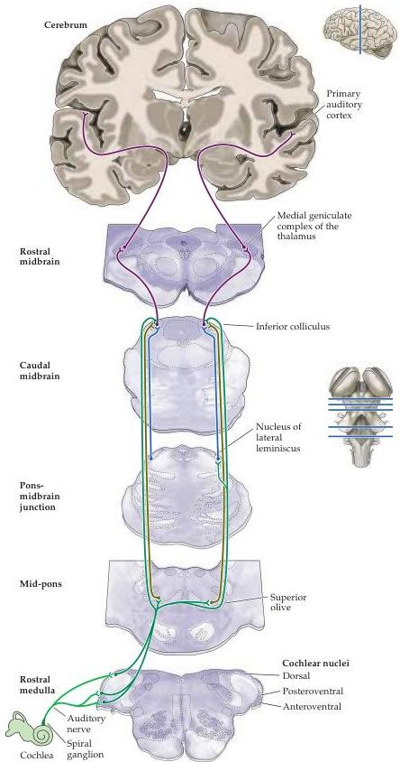

Chapter Twelve

Figure 12.12 Diagram of the major auditory pathways.
Although many details are missing from this diagram, two important points are evident: (1) the auditory system entails several parallel pathways, and (2) information from each ear reaches both sides of the system, even at the level of the brainstem.