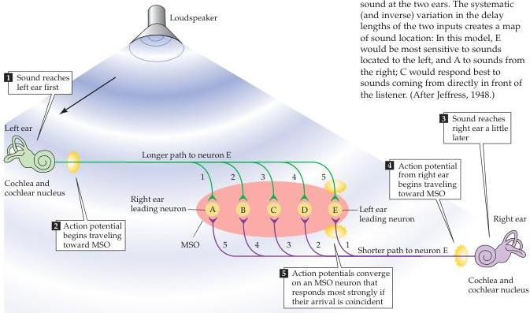

The Auditory System 305

How is timing in the 10 microseconds range accomplished by neural components that operate in the millisecond range? The neural circuitry that computes such tiny interaural time differences consists of binaural inputs to the medial superior olive (MSO) that arise from the right and left anteroventral cochlear nuclei (Figure 12.13; see also Figure 12.12).
The medial superior olive contains cells with bipolar dendrites that extend both medially and laterally.
The lateral dendrites receive input from the ipsilateral anteroventral cochlear nucleus, and the medial dendrites receive input from the contralateral anteroventral cochlear nucleus (both inputs are excitatory).
As might be expected, the MSO cells work as coincidence detectors, responding when both excitatory signals arrive at the same time.
For a coincidence mechanism to be useful in localizing sound, different neurons must be maximally sensitive to different interaural time delays.
The axons that project from the anteroventral cochlear nucleus evidently vary systematically in length to create delay lines.
(Remember that the length of an axon divided by its conduction velocity equals the conduction time.) These anatomical differences compensate for sounds arriving at slightly different times at the two ears, so that the resultant neural impulses arrive at a particular MSO neuron simultaneously, making each cell especially sensitive to sound sources in a particular place.
The mechanisms enabling MSO neurons to function as coincidence detectors at the microsecond level are still poorly understood, but certainly reflect one of the more impressive biophysical specializations in the nervous system.

Sound localization perceived on the basis of interaural time differences requires phase-locked information from the periphery, which, as already

Figure 12.13 Diagram illustrating how the MSO computes the location of a sound by interaural time differences.
A given MSO neuron responds most strongly when the two inputs arrive simultaneously, as occurs when the contralateral and ipsilateral inputs precisely compensate (via their different lengths) for differences in the time of arrival of a sound at the two ears.
The systematic (and inverse) variation in the delay lengths of the two inputs creates a map of sound location: In this model, E would be most sensitive to sounds located to the left, and A to sounds from the right; C would respond best to sounds coming from directly in front of the listener.
(After Jeffress, 1948.)