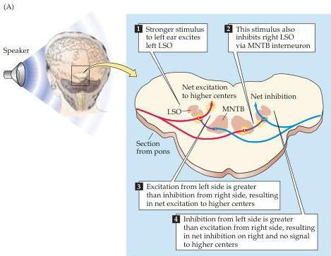
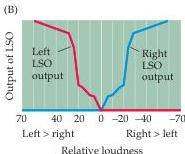

Chapter Twelve

emphasized, is available to humans only for frequencies below  $3\mathrm{kHz}$ .
(In barn owls, the reigning champions of sound localization, phase locking occurs at up to  $9\mathrm{kHz}$ .) Therefore, a second mechanism must come into play at higher frequencies.
At frequencies higher than about  $2\mathrm{kHz}$ , the human head begins to act as an acoustical obstacle because the wavelengths of the sounds are too short to bend around it.
As a result, when high-frequency sounds are directed toward one side of the head, an acoustical "shadow" of lower intensity is created at the far ear.
These intensity differences provide a second cue about the location of a sound.
The circuits that compute the position of a sound source on this basis are found in the lateral superior olive (LSO) and the medial nucleus of the trapezoid body (MNTB) (Figure 12.14).
Excitatory axons project directly from the ipsilateral anteroventral cochlear nucleus to the LSO (as well as to the MSO; see Figure 12.13).
Note that the LSO also receives inhibitory input from the contralateral ear, via an inhibitory neuron in the MNTB.
This excitatory/inhibitory interaction

Figure 12.14 Lateral superior olive neurons encode sound location through interaural intensity differences.
(A) LSO neurons receive direct excitation from the ipsilateral cochlear nucleus; input from the contralateral cochlear nucleus is relayed via inhibitory interneurons in the MNTB.
(B) This arrangement of excitation-inhibition makes LSO neurons fire most strongly in response to sounds arising directly lateral to the listener on the same side as the LSO, because excitation from the ipsilateral input will be great and inhibition from the contralateral input will be small.
In contrast, sounds arising from in front of the listener, or from the opposite side, will silence the LSO output, because excitation from the ipsilateral input will be minimal, but inhibition driven by the contralateral input will be great.
Note that LSOs are paired and bilaterally symmetrical; each LSO only encodes the location of sounds arising on the same side of the body as its location.

