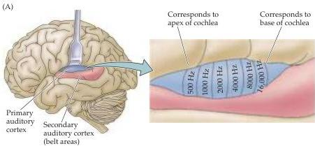
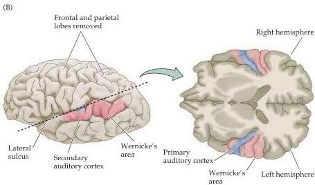

The Auditory System 309

virtue of its convergent inputs, mediates the detection of specific spectral and temporal combinations of sounds.
In many species, including humans, varying spectral and temporal cues are especially important features of communication sounds.
It is not known whether cells in the human medial geniculate are selective to combinations of sounds, but the processing of speech certainly requires both spectral and temporal combination sensitivity.

## The Auditory Cortex

The ultimate target of afferent auditory information is the auditory cortex.
Although the auditory cortex has a number of subdivisions, a broad distinction can be made between a primary area and peripheral, or belt, areas.
The primary auditory cortex (A1) is located on the superior temporal gyrus in the temporal lobe and receives point-to-point input from the ventral division of the medial geniculate complex; thus, it contains a precise tonotopic map.
The belt areas of the auditory cortex receive more diffuse input from the belt areas of the medial geniculate complex and therefore are less precise in their tonotopic organization.

The primary auditory cortex (A1) has a topographical map of the cochlea (Figure 12.15), just as the primary visual cortex (V1) and the primary somatic sensory cortex (S1) have topographical maps of their respective sensory

Figure 12.15 The human auditory cortex.
(A) Diagram showing the brain in left lateral view, including the depths of the lateral sulcus, where part of the auditory cortex occupying the superior temporal gyrus normally lies hidden.
The primary auditory cortex (A1) is shown in blue; the surrounding belt areas of the auditory cortex are in red.
The primary auditory cortex has a tonotopic organization, as shown in this blowup diagram of a segment of A1 (right).
(B) Diagram of the brain in left lateral view, showing locations of human auditory cortical areas related to processing speech sounds in the intact hemisphere.
Right: An oblique section (plane of dashed line) shows the cortical areas on the superior surface of the temporal lobe.
Note that Wernicke's area, a region important in comprehending speech, is just posterior to the primary auditory cortex.

