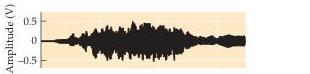
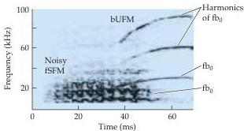

Chapter Twelve

# Box E

## Representing Complex Sounds in the Brains of Bats and Humans

Most natural sounds are complex, meaning that they differ from the pure tones or clicks that are frequently used in neurophysiological studies of the auditory system.
Rather, natural sounds are tonal: they have a fundamental frequency that largely determines the "pitch" of the sound, and one or more harmonics of different intensities that contribute to the quality or "timbre" of a sound.
The frequency of a harmonic is, by definition, a multiple of the fundamental frequency, and both may be modulated over time.
Such frequency-modulated (FM) sweeps can rise or fall in frequency, or change in a sinusoidal or some other fashion.
Occasionally, multiple nonharmonic frequencies may be simultaneously present in some communication or musical sounds.
In some sounds, a level of spectral splatter or "broadband noise" is embedded within tonal or frequency modulated sounds.
The variations in the sound spectrum are typically accompanied by a modulation of the amplitude envelop of the complex sound as well.
All of these features can be visualized by performing a spectrographic analysis.

How does the brain represent such complex natural sounds? Cognitive studies of complex sound perception provide some understanding of how a large but limited number of neurons in the brain can dynamically represent an infinite variety of natural stimuli in the sensory

(A) Amplitude envelope (above) and spectrogram (below) of a composite syllable emitted by mustached bats for social communication.
This composite consists of two simple syllables, a fixed Sinusoidal FM (fSFM) and a bent Upward FM (bUFM) that emerges from the fSFM after some overlap.
Each syllable has its own fundamental  $(\mathrm{fa}_0$  and  $\mathrm{fb}_0)$  and multiple harmonics.
(Courtesy of Jagmeet Kanwal.)

environment of humans and other animals.
In bats, specializations for processing complex sounds are apparent.
Studies in echolocating bats show that both communication and echolocation sounds (Figure A) are processed not only within some of the same areas, but also within the same neurons in the auditory cortex.
In humans, multiple modes of processing are also likely, given the large overlap within the superior and middle temporal gyri in the temporal lobe for the repre

sentation of different types of complex sounds.

Asymmetrical representation is another common principle of complex sound processing that results in lateralized (though largely overlapping) representations of natural stimuli.
Thus, speech sounds that are important for communication are lateralized to the left in the belt regions of the auditory cortex, whereas environmental sounds that are important for reacting to and recognize

epithelia.
Unlike the visual and somatic sensory systems, however, the cochlea has already decomposed the acoustical stimulus so that it is arrayed tonotopically along the length of the basilar membrane.
Thus, A1 is said to comprise a tonotopic map, as do most of the ascending auditory structures between the cochlea and the cortex.
Orthogonal to the frequency axis of the tonotopic map is a striped arrangement of binaural properties.
The neurons in one stripe are excited by both ears (and are therefore called EE cells), while the neurons in the next stripe are excited by one ear and inhibited by the other ear (EI cells).
The EE and EI stripes alternate, an arrangement that is reminiscent of the ocular dominance columns in V1 (see Chapter 11).