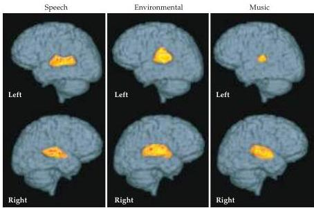
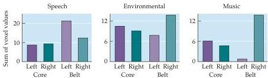

The Auditory System 311

ing aspects of the auditory environment are represented in each hemisphere (Figure B).
Musical sounds that can either motivate us to march in war or to relax and meditate when coping with physical and emotional stress are highly lateralized to the right in the belt regions of the auditory cortex.
The extent of lateralization for speech and possibly music may vary with sex, age, and training.
In some species of bats, mice, and primates, processing of natural communication sounds appears to be lateralized to the left hemisphere.
In summary, natural sounds are complex and their representation within the sensory cortex tends to be asymmetric across the two hemispheres.

(B) Top: Reconstructed functional magnetic resonance images of BOLD contrast signal change (average for 8 subjects) showing significant $(p &lt; 0.001)$ activation elicited by speech, environmental, and musical sounds on surface views of the left versus the right side of the human brain.
Bottom: Bar graphs showing the total significant activation to each category of complex sounds in the core and belt areas of the auditory cortex for the left versus the right side.
(Courtesy of Jagmeet Kanwal.)

# References

EHRET, G.
(1987) Left hemisphere advantage in the mouse brain for recognizing ultrasonic communication calls.
Nature 325: 249-251.
ESSER, K.-H., C.
J.
CONDON, N.
SUGA AND J.
S.
KANWAL (1997) Syntax processing by auditory cortical neurons in the FM-FM area of the mustached bat, Pteronotus parnellii.
Proc.
Natl.
Acad.
Sci.
USA 94: 14019-14024.
HAUSER, M.
D.
AND K.
ANDERSSON (1994) Left hemisphere dominance for processing vocalizations in adult, but not infant, rhesus monkeys: Field experiments.
Proc.
Natl.
Acad.
Sci.
USA 91: 3946-3948.
KANWAL, J.
S., J.
KIM AND K.
KAMADA (2000) Separate, distributed processing of environmental, speech and musical sounds in the cerebral hemispheres.
J.
Cog.
Neurosci.
(Supp.): p.
32.
KANWAL, J.
S., J.
S.
MATSUMURA, K.
OHLEMILLER AND N.
SUGA (1994) Acoustic elements and syntax in communication sounds emitted by mustached bats.
J.
Acous.
Soc.
Am.
96: 1229-1254.
KANWAL, J.
S.
AND N.
SUGA (1995) Hemispheric asymmetry in the processing of calls in the auditory cortex of the mustached bat.
Assoc.
Res.
Otolaryngol.
18: 104.

The auditory cortex obviously does much more than provide a tonotopic map and respond differentially to ipsi- and contralateral stimulation.
Although the sorts of sensory processing that occur in the auditory cortex are not well understood, they are likely to be important to higher-order processing of natural sounds, especially those used for communication (Box E; see also Chapter 26).
One clue about such processing comes from work in marmosets, a small neotropical primate with a complex vocal repertoire.
The primary auditory cortex and belt areas of these animals are indeed organized tonotopically, but also contain neurons that are strongly responsive to spectral combinations that characterize certain vocalizations.
The responses