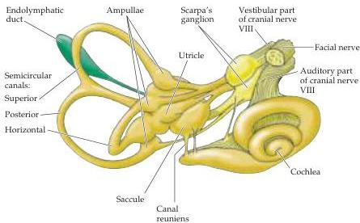

Chapter Thirteen

Figure 13.1 The labyrinth and its innervation.
The vestibular and auditory portions of the eighth nerve are shown; the small connection from the vestibular nerve to the cochlea contains auditory efferent fibers.
General orientation in head is shown in Figure 12.3; see also Figure 13.8.

The intimate relationship between the cochlea and the labyrinth goes beyond their common embryonic origin.
Indeed, the cochlear and vestibular spaces are actually joined (see Figure 13.1), and the specialized ionic environments of the vestibular end organ parallel those of the cochlea.
The membranous sacs within the bone are filled with fluid (endolymph) and are collectively called the membranous labyrinth.
The endolymph (like the cochlear endolymph) is similar to intracellular solutions in that it is high in  $\mathbf{K}^{+}$  and low in  $\mathrm{Na^{+}}$ .
Between the bony walls (the osseous labyrinth) and the membranous labyrinth is another fluid, the perilymph, which is similar in composition to cerebrospinal fluid (i.e., low in  $\mathbf{K}^{+}$  and high in  $\mathrm{Na^{+}}$ ; see Chapter 12).

The vestibular hair cells are located in the utricle and saccule and in three juglike swellings called ampullae, located at the base of the semicircular canals next to the utricle.
Within each ampulla, the vestibular hair cells extend their hair bundles into the endolymph of the membranous labyrinth.
As in the cochlea, tight junctions seal the apical surfaces of the vestibular hair cells, ensuring that endolymph selectively bathes the hair cell bundle while remaining separate from the perilymph surrounding the basal portion of the hair cell.

# Vestibular Hair Cells

The vestibular hair cells, which like cochlear hair cells transduce minute displacements into behaviorally relevant receptor potentials, provide the basis for vestibular function.
Vestibular and auditory hair cells are quite similar; a detailed description of hair cell structure and function has already been given in Chapter 12.
As in the case of auditory hair cells, movement of the stereocilia toward the kinocilium in the vestibular end organs opens mechanically gated transduction channels located at the tips of the stereocilia, depolarizing the hair cell and causing neurotransmitter release onto (and excitation of) the vestibular nerve fibers.
Movement of the stereocilia in the direction away from the kinocilium closes the channels, hyperpolarizing the hair cell and thus reducing vestibular nerve activity.
The biphasic nature of the receptor potential means that some transduction channels are open in the absence of stimulation, with the result that hair cells tonically release