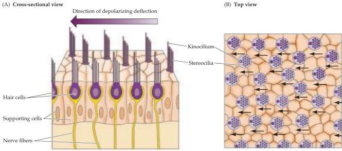
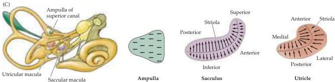

The Vestibular System 317

transmitter, thereby generating considerable spontaneous activity in vestibular nerve fibers (see Figure 13.6).
One consequence of these spontaneous action potentials is that the firing rates of vestibular fibers can increase or decrease in a manner that faithfully mimics the receptor potentials produced by the hair cells (Box B).

Importantly, the hair cell bundles in each vestibular organ have specific orientations (Figure 13.2).
As a result, the organ as a whole is responsive to displacements in all directions.
In a given semicircular canal, the hair cells in the ampulla are all polarized in the same direction.
In the utricle and saccule, a specialized area called the striola divides the hair cells into two populations with opposing polarities (Figure 13.2C; see also Figure 13.4C).
The directional polarization of the receptor surfaces is a basic principle of organization in the vestibular system, as will become apparent in the following descriptions of the individual vestibular organs.

## The Otolith Organs: The Utricle and Saccule

Displacements and linear accelerations of the head, such as those induced by tilting or translational movements (see Box A), are detected by the two otolith organs: the saccule and the utricle.
Both of these organs contain a

Figure 13.2 The morphological polarization of vestibular hair cells and the polarization maps of the vestibular organs.
(A) A cross section of hair cells shows that the kinocilia of a group of hair cells are all located on the same side of the hair cell.
The arrow indicates the direction of deflection that depolarizes the hair cell.
(B) View looking down on the hair bundles.
(C) In the ampulla located at the base of each semicircular canal, the hair bundles are oriented in the same direction.
In the sacculus and utricle, the striola divides the hair cells into populations with opposing hair bundle polarities.

