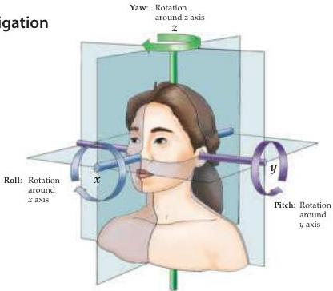
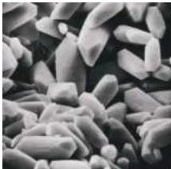

Chapter Thirteen

# Box A

## A Primer on Vestibular Navigation

The function of the vestibular system can be simplified by remembering some basic terminology of classical mechanics.
All bodies moving in a three-dimensional framework have six degrees of freedom: three of these are translational and three are rotational.
The translational elements refer to linear movements in the $x, y,$ and $z$ axes (the horizontal and vertical planes).
Translational motion in these planes (linear acceleration and static displacement of the head) is the primary concern of the otolith organs.
The three degrees of rotational freedom refer to a body's rotation relative to the $x, y,$ and $z$ axes and are commonly referred to as roll, pitch, and yaw.
The semicircular canals are primarily responsible for sensing rotational accelerations around these three axes.

Figure 13.3 Scanning electron micrograph of calcium carbonate crystals (otoconia) in the utricular macula of the cat.
Each crystal is about $50\mathrm{mm}$ long.
(From Lindeman, 1973.)

sensory epithelium, the macula, which consists of hair cells and associated supporting cells.
Overlying the hair cells and their hair bundles is a gelatinous layer; above this layer is a fibrous structure, the otolithic membrane, in which are embedded crystals of calcium carbonate called otoconia (Figures 13.3 and 13.4A).
The crystals give the otolith organs their name (otolith is Greek for "ear stones").
The otoconia make the otolithic membrane considerably heavier than the structures and fluids surrounding it; thus, when the head tilts, gravity causes the membrane to shift relative to the sensory epithelium (Figure 13.4B).
The resulting shearing motion between the otolithic membrane and the macula displaces the hair bundles, which are embedded in the lower, gelatinous surface of the membrane.
This displacement of the hair bundles generates a receptor potential in the hair cells.
A shearing motion between the macula and the otolithic membrane also occurs when the head undergoes linear accelerations (see Figure 13.5); the greater relative mass of the otolithic membrane causes it to lag behind the macula temporarily, leading to transient displacement of the hair bundle.

The similar effects exerted on otolithic hair cells by certain head tilts and linear accelerations would be expected to render these different stimuli perceptually equivalent when visual feedback is absent, as occurs in the dark or when the eyes are closed.
Nevertheless, evidence suggests that subjects can discriminate between these two stimulus categories, apparently through combined activity of the otolith organs and the semicircular canals.

As already mentioned, the orientation of the hair cell bundles is organized relative to the striola, which demarcates the overlying layer of otoco