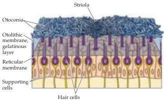
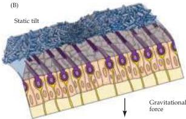
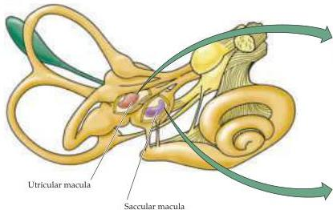
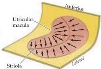
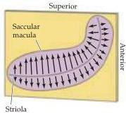

The Vestibular System 319

(A)

(B)

(C)

Figure 13.4 Morphological polarization of hair cells in the utricular and saccular maculae.
(A) Cross section of the utricular macula showing hair bundles projecting into the gelatinous layer when the head is level.
(B) Cross section of the utricular macula when the head is tilted.
(C) Orientation of the utricular and saccular maculae in the head; arrows show orientation of the kinocilia, as in Figure 13.2.
The saccules on either side are oriented more or less vertically, and the utricles more or less horizontally.
The striola is a structural landmark consisting of small otoconia arranged in a narrow trench that divides each otolith organ.
In the utricular macula, the kinocilia are directed toward the striola.
In the saccular macula, the kinocilia point away from the striola.
Note that, given the utricle and sacculus on both sides of the body, there is a continuous representation of all directions of body movement.

nia (see Figure 13.4A).
The striola forms an axis of mirror symmetry such that hair cells on opposite sides of the striola have opposing morphological polarizations.
Thus, a tilt along the axis of the striola will excite the hair cells on one side while inhibiting the hair cells on the other side.
The saccular macula is oriented vertically and the utricular macula horizontally, with a continuous variation in the morphological polarization of the hair cells