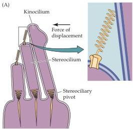
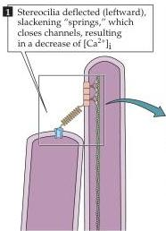
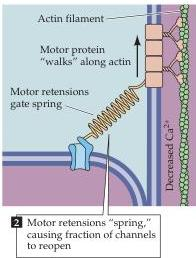

Chapter Thirteen

# Box B

## Adaptation and Tuning of Vestibular Hair Cells

### Hair Cell Adaptation

The minuscule movement of the hair bundle at sensory threshold has been compared to the displacement of the top of the Eiffel Tower by a thumb's breadth! Despite its great sensitivity, the hair cell can adapt quickly and continuously to static displacements of the hair bundle caused by large movements.
Such adjustments are especially useful in the otolith organs, where adaptation permits hair cells to maintain sensitivity to small linear and angular accelerations of the head despite the constant input from gravitational forces that are over a million times greater.
In other receptor cells, such as photoreceptors, adaptation is accomplished by regulating the second messenger cascade induced by the initial transduction event.
The hair cell has to depend on a different strategy, however, because there is no second messenger system between the initial transduction event and the subsequent receptor potential (as might be expected for receptors that respond so rapidly).

Adaptation occurs in both directions in which the hair bundle displacement generates a receptor potential, albeit at different rates for each direction.
When the hair bundle is pushed toward the kinocilium, tension is initially increased in the gating spring.
During adaptation, tension decreases back to the resting level, perhaps because one end of the gating spring repositions itself along the shank of the stereocilium.
When the hair bundle is displaced in the opposite direction, away from the kinocilium, tension in the spring initially decreases; adaptation then involves an increase in spring tension.
One theory is that a calcium-regulated motor such as a myosin ATPase climbs along actin filaments in the stereocilium and actively resets the tension in the transduction spring.
During sustained depolarization, some $\mathrm{Ca^{2+}}$ enters through the transduction channel, along with $\mathrm{K}^+$.
$\mathrm{Ca^{2+}}$ then causes the motor to spend a greater fraction of its time unbound from the actin, resulting in slippage of the spring down the side of the stereocilium.
During sustained hyperpolarization (Figure A), $\mathrm{Ca^{2+}}$ levels drop below normal resting levels and the motor spends more of its time bound to the actin, thus climbing up the actin filaments and increasing the spring tension.
As tension increases, some of the previously closed transduction channels open, admitting $\mathrm{Ca^{2+}}$ and thus slowing the motor's progress until a balance is struck between the climbing and slipping of the motor.
In support of this model, when internal $\mathrm{Ca^{2+}}$ is reduced artificially, spring tension increases.
This model of hair cell adaptation presents an elegant molecular solution to the regulation of a mechanical process.

### Electrical Tuning

Although mechanical tuning plays an important role in generating frequency selectivity in the cochlea, there are other mechanisms that contribute to this process in vestibular and auditory nerve cells.
These other tuning mechanisms are especially important in the otolith organs, where, unlike the cochlea, there are no

(A) Adaptation is explained in the gating spring model by adjustment of the insertion point of tips links.
Movement of the insertion point up or down the shank of the stereocilium, perhaps driven by a $\mathrm{Ca^{2+}}$-dependent protein motor, can continually adjust the resting tension of the tip link.
(After Hudspeth and Gillespie, 1994.)

