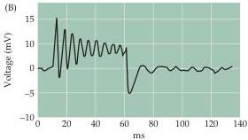
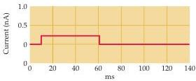
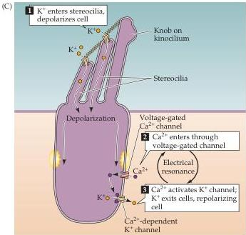

The Vestibular System 321

obvious macromechanical resonances to selectively filter and/or enhance biologically relevant movements.
One such mechanism is an electrical resonance displayed by hair cells in response to depolarization: The membrane potential of a hair cell undergoes damped sinusoidal oscillations at a specific frequency in response to the injection of depolarizing current pulses (Figure B).

The ionic mechanism of this process involves two major types of ion channels located in the membrane of the hair cell soma.
The first of these is a voltage-activated $\mathrm{Ca^{2+}}$ conductance, which lets $\mathrm{Ca^{2+}}$ into the cell soma in response to depolarization, such as that generated by the transduction current.
The second is a $\mathrm{Ca^{2+}}$-activated $\mathrm{K}^+$ conductance, which is triggered by the rise in internal $\mathrm{Ca^{2+}}$ concentration.
These two currents produce an interplay of depolarization and repolarization that results in electrical resonance (Figure C).
Activation of the hair cell's calcium-activated $\mathrm{K}^+$ conductance

occurs 10 to 100 times faster than that of similar currents in other cells.
Such rapid kinetics allow this conductance to generate an electrical response that usually requires the fast properties of a voltage-gated channel.

Although a hair cell responds to hair bundle movement over a wide range of frequencies, the resultant receptor potential is largest at the frequency of electrical resonance.
The resonance frequency represents the characteristic frequency of the hair cell, and transduction at that frequency will be most efficient.
This electrical resonance has important implications for structures like the utricle and sacculus, which may encode a range of characteristic frequencies based on the different resonance frequencies of their constituent hair cells.
Thus, electrical tuning in the otolith organs can generate enhanced tuning to biologically relevant frequencies of stimulation, even in the absence of macromechanical resonances within these structures.

## References

Assad, J.
A.
and D.
P.
Corey (1992) An active motor model for adaptation by vertebrate hair cells.
J.
Neurosci.
12: 3291-3309.
CRAWFORD, A.
C.
AND R.
FETTIPLACE (1981) An electrical tuning mechanism in turtle cochlear hair cells.
J.
Physiol.
312: 377-412.
HUDSPETH, A.
J.
(1985) The cellular basis of hearing: The biophysics of hair cells.
Science 230: 745-752.
HUDSPETH, A.
J.
AND P.
G.
GILLESPIE (1994) Pulling strings to tune transduction: Adaptation by hair cells.
Neuron 12: 1-9.
LEWIS, R.
S.
AND A.
J.
HUDSPETH (1988) A model for electrical resonance and frequency tuning in saccular hair cells of the bull-frog, Rana catesbeiana.
J.
Physiol.
400: 275-297.
LEWIS, R.
S.
AND A.
J.
HUDSPETH (1983) Voltage- and ion-dependent conductances in solitary vertebrate hair cells.
Nature 304: 538-541.
SHEPHERD, G.
M.
G.
AND D.
P.
COREY (1994) The extent of adaptation in bullfrog saccular hair cells.
J.
Neurosci.
14: 6217-6229.

(B) Voltage oscillations (upper trace) in an isolated hair cell in response to a depolarizing current injection (lower trace).
(After Lewis and Hudspeth, 1983.)

(C) Proposed ionic basis for electrical resonance in hair cells.
(After Hudspeth, 1985.)