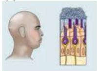
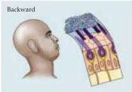
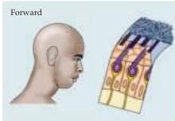
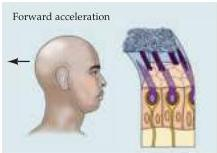
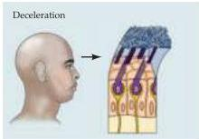

Chapter Thirteen

located in each macula (as shown in Figure 13.4C, where the arrows indicate the direction of movement that produces excitation).
Inspection of the excitatory orientations in the maculae indicates that the utricle responds to movements of the head in the horizontal plane, such as sideways head tilts and rapid lateral displacements, whereas the saccule responds to movements in the vertical plane (up-down and forward-backward movements in the sagittal plane).

Note that the saccular and utricular maculae on one side of the head are mirror images of those on the other side.
Thus, a tilt of the head to one side has opposite effects on corresponding hair cells of the two utricular maculae.
This concept is important in understanding how the central connections of the vestibular periphery mediate the interaction of inputs from the two sides of the head (see the next section).

## How Otolith Neurons Sense Linear Forces

The structure of the otolith organs enables them to sense both static displacements, as would be caused by tilting the head relative to the gravitational axis, and transient displacements caused by translational movements of the head.
The mass of the otolithic membrane relative to the surrounding endolymph, as well as the otolithic membrane's physical uncoupling from the underlying macula, means that hair bundle displacement will occur transiently in response to linear accelerations and tonically in response to tilting of the head.
Therefore, both tonic and transient information can be conveyed by these sense organs.
Figure 13.5 illustrates some of the forces produced by head tilt and linear accelerations on the utricular macula.

These properties of hair cells are reflected in the responses of the vestibular nerve fibers that innervate the otolith organs.
The nerve fibers have a

Figure 13.5 Forces acting on the head and the resulting displacement of the otolithic membrane of the utricular macula.
For each of the positions and accelerations due to translational movements, some set of hair cells will be maximally excited, whereas another set will be maximally inhibited.
Note that head tilts produce displacements similar to certain accelerations.

Head tilt; sustained

