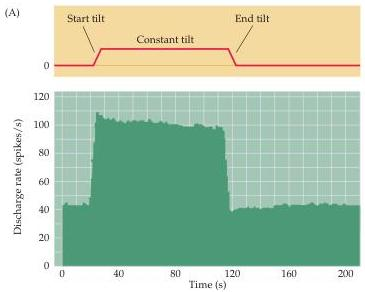
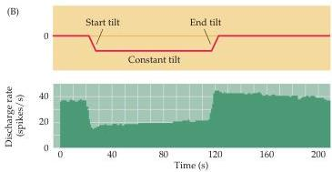

The Vestibular System 323

Figure 13.6 Response of a vestibular nerve axon from an otolith organ (the utricle in this example).
(A) The stimulus (top) is a change in head tilt.
The spike histogram shows the neuron's response to tilting in a particular direction.
(B) A response of the same fiber to tilting in the opposite direction.
(After Goldberg and Fernandez, 1976.)

steady and relatively high firing rate when the head is upright.
The change in firing rate in response to a given movement can be either sustained or transient, thereby signaling either absolute head position or linear acceleration.
An example of the sustained response of a vestibular nerve fiber innervating the utricle is shown in Figure 13.6.
The responses were recorded from axons in a monkey seated in a chair that could be tilted for several seconds to produce a steady force.
Prior to the tilt, the axon has a high firing rate, which increases or decreases depending on the direction of the tilt.
Notice also that the response remains at a high level as long as the tilting force remains constant; thus, such neurons faithfully encode the static force being applied to the head (Figure 13.6A).
When the head is returned to the original position, the firing level of the neurons returns to baseline value.
Conversely, when the tilt is in the opposite direction, the neurons respond by decreasing their firing rate below the resting level (Figure 13.6B) and remain depressed as long as the static force continues.
In a similar fashion, transient increases or decreases in firing rate from spontaneous levels signal the direction of linear accelerations of the head.

The range of orientations of hair bundles within the otolith organs enables them to transmit information about linear forces in every direction