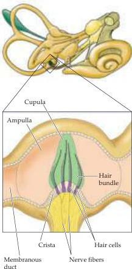

Chapter Thirteen

Figure 13.7 The ampulla of the posterior semicircular canal showing the crista, hair bundles, and cupula.
The cupula is distorted by the fluid in the membranous canal when the head rotates.

the body moves (see Figure 13.4C).
The utricle, which is primarily concerned with motion in the horizontal plane, and the saccule, which is concerned with vertical motion, combine to effectively gauge the linear forces acting on the head at any instant in three dimensions.
Tilts of the head off the horizontal plane and translational movements of the head in any direction stimulate a distinct subset of hair cells in the saccular and utricular maculae, while simultaneously suppressing the responses of other hair cells in these organs.
Ultimately, variations in hair cell polarity within the otolith organs produce patterns of vestibular nerve fiber activity that, at a population level, can unambiguously encode head position and the forces that influence it.

## The Semicircular Canals

Whereas the otolith organs are primarily concerned with head translations and orientation with respect to gravity, the semicircular canals sense head rotations, arising either from self-induced movements or from angular accelerations of the head imparted by external forces.
Each of the three semicircular canals has at its base a bulbous expansion called the ampulla (Figure 13.7), which houses the sensory epithelium, or crista, that contains the hair cells.
The structure of the canals suggests how they detect the angular accelerations that arise through rotation of the head.
The hair bundles extend out of the crista into a gelatinous mass, the cupula, that bridges the width of the ampulla, forming a fluid barrier through which endolymph cannot circulate.
As a result, the relatively compliant cupula is distorted by movements of the endolymphatic fluid.
When the head turns in the plane of one of the semicircular canals, the inertia of the endolymph produces a force across the cupula, distending it away from the direction of head movement and causing a displacement of the hair bundles within the crista (Figure 13.8A,B).
In contrast, linear accelerations of the head produce equal forces on the two sides of the cupula, so the hair bundles are not displaced.

Unlike the saccular and utricular maculae, all of the hair cells in the crista within each semicircular canal are organized with their kinocilia pointing in the same direction (see Figure 13.2C).
Thus, when the cupula moves in the appropriate direction, the entire population of hair cells is depolarized and activity in all of the innervating axons increases.
When the cupula moves in the opposite direction, the population is hyperpolarized and neuronal activity decreases.
Deflections orthogonal to the excitatory-inhibitory direction produce little or no response.

Each semicircular canal works in concert with the partner located on the other side of the head that has its hair cells aligned oppositely.
There are three such pairs: the two pairs of horizontal canals, and the superior canal on each side working with the posterior canal on the other side (Figure 13.8C).
Head rotation deforms the cupula in opposing directions for the two partners, resulting in opposite changes in their firing rates (Box C).
Thus, the orientation of the horizontal canals makes them selectively sensitive to rotation in the horizontal plane.
More specifically, the hair cells in the canal towards which the head is turning are depolarized, while those on the other side are hyperpolarized.

For example, when the head accelerates to the left, the cupula is pushed toward the kinocilium in the left horizontal canal, and the firing rate of the relevant axons in the left vestibular nerve increases.
In contrast, the cupula in the right horizontal canal is pushed away from the kinocilium, with a concomitant decrease in the firing rate of the related neurons.
If the head movement is