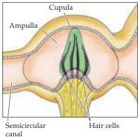
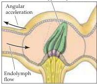
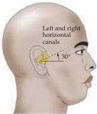
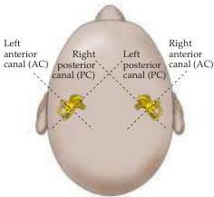

The Vestibular System 325

(A)

(B)

(C)

Figure 13.8 Functional organization of the semicircular canals.
(A) The position of the cupula without angular acceleration.
(B) Distortion of the cupula during angular acceleration.
When the head is rotated in the plane of the canal (arrow outside canal), the inertia of the endolymph creates a force (arrow inside the canal) that displaces the cupula.
(C) Arrangement of the canals in pairs.
The two horizontal canals form a pair; the right anterior canal (AC) and the left posterior canal (PC) form a pair; and the left AC and the right PC form a pair.

to the right, the result is just the opposite.
This push-pull arrangement operates for all three pairs of canals; the pair whose activity is modulated is in the plane of the rotation, and the member of the pair whose activity is increased is on the side toward which the head is turning.
The net result is a system that provides information about the rotation of the head in any direction.

# How Semicircular Canal Neurons Sense Angular Accelerations

Like axons that innervate the otolith organs, the vestibular fibers that innervate the semicircular canals exhibit a high level of spontaneous activity.
As a result, they can transmit information by either increasing or decreasing their firing rate, thus more effectively encoding head movements (see above).
The bidirectional responses of fibers innervating the hair cells of the semicircular canal have been studied by recording the axonal firing rates in a monkey's