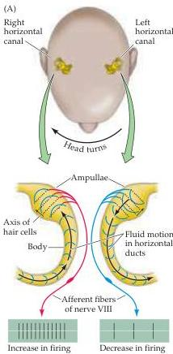
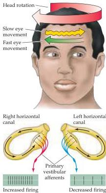
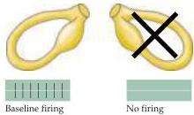

Chapter Thirteen

# Box C

## Throwing Cold Water on the Vestibular System

Testing the integrity of the vestibular system can indicate much about the condition of the brainstem, particularly in comatose patients.

Normally, when the head is not being rotated, the output of the nerves from the right and left sides are equal; thus, no eye movements occur.
When the head is rotated in the horizontal plane, the vestibular afferent fibers on the side toward the turning motion increase their firing rate, while the afferents on the opposite side decrease their firing rate (Figures A and B).
The net difference in firing rates then leads to slow movements of the eyes counter to the turning motion.
This reflex response generates the slow component of a normal eye movement pattern called physiological nystagmus, which means "nodding" or oscillatory movements of the eyes (Figure B1).
(The fast component is a saccade that resets the eye position; see Chapter 19.)

Pathological nystagmus can occur if there is unilateral damage to the vestibular system.
In this case, the silencing of the spontaneous output from the damaged side results in an unphysiological difference in firing rate because the spontaneous discharge from the intact side remains (Figure B2).
The difference in firing rates causes nystagmus, even though no head movements are being made.

Responses to vestibular stimulation are thus useful in assessing the integrity of the brainstem in unconscious patients.
If the individual is placed on his or her back and the head is elevated to about $30^{\circ}$ above horizontal, the horizontal semicircular canals lie in an almost vertical orientation.
Irrigating one ear with cold water will then lead to spontaneous eye movements because convection currents in the canal mimic rotatory head movements away from the irrigated ear (Figure C).
In normal individuals, these eye movements consist of a slow movement toward the irrigated ear and a fast movement away from it.
The fast movement is most readily detected by the observer, and the significance of its direction can be kept in mind by using the

(A) View looking down on the top of a person's head illustrates the fluid motion generated in the left and right horizontal canals, and the changes in vestibular nerve firing rates when the head turns to the right.
(B) In normal individuals, rotating the head elicits physiological nystagmus (1), which consists of a slow eye movement counter to the direction of head turning.
The slow component of the eye movements is due to the net differences in left and right vestibular nerve firing rates acting via the central circuit diagrammed in Figure 13.10.
Spontaneous nystagmus (2), where the eyes move rhythmically from side to side in the absence of any head movements, occurs when one of the canals is damaged.
In this situation, net differences in vestibular nerve firing rates exist even when the head is stationary because the vestibular nerve innervating the intact canal fires steadily when at rest, in contrast to a lack of activity on the damaged side.

(B)
(1) Physiological nystagmus

(2) Spontaneous nystagmus