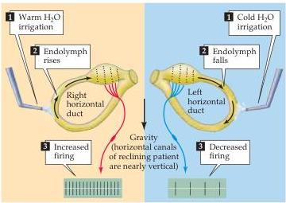
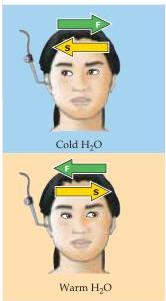
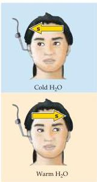
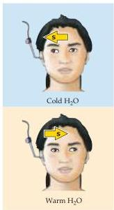
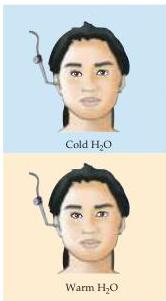

The Vestibular System 327

(C)

mnemonic COWS ("Cold Opposite, Warm Same").
This same test can also be used in unconscious patients.
In patients who are comatose due to dysfunction of both cerebral hemispheres but whose brainstem is intact, saccadic movements are no longer made and the response to

cold water consists of only the slow movement component of the eyes to side of the irrigated ear (Figure D).
In the presence of brainstem lesions involving either the vestibular nuclei themselves, the connections from the vestibular nuclei to oculomotor nuclei (the third,

(C) Caloric testing of vestibular function is possible because irrigating an ear with water slightly warmer than body temperature generates convection currents in the canal that mimic the endolymph movement induced by turning the head to the irrigated side.
Irrigation with cold water induces the opposite effect.
These currents result in changes in the firing rate of the associated vestibular nerve, with an increased rate on the warmed side and a decreased rate on the chilled side.
As in head rotation and spontaneous nystagmus, net differences in firing rates generate eye movements.

fourth, or sixth cranial nerves), or the peripheral nerves exiting these nuclei, vestibular responses are abolished (or altered, depending on the severity of the lesion).

(D) Caloric testing can be used to test the function of the brainstem in an unconscious patient.
The figures show eye movements resulting from cold or warm water irrigation in one ear for (1) a normal subject, and in three different conditions in an unconscious patient: (2) with the brainstem intact; (3) with a lesion of the medial longitudinal fasciculus (MLF; note that irrigation in this case results in lateral movement of the eye only on the less active side); and (4) with a low brainstem lesion (see Figure 13.10).

(D)

|  Ocular reflexes in conscious patients (1) Normal | (2) Brainstem intact | Ocular reflexes in unconscious patients (3) MLF lesion (bilateral) | (4) Low brainstem lesion  |
| --- | --- | --- | --- |
|   |  |  |   |
|  Warm H₂O | Warm H₂O | Warm H₂O | Warm H₂O  |