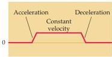
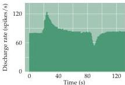

Chapter Thirteen

Figure 13.9 Response of a vestibular nerve axon from the semicircular canal to angular acceleration.
The stimulus (top) is a rotation that first accelerates, then maintains constant velocity, and then decelerates the head.
The axon increases its firing above resting level in response to the acceleration, returns to resting level during constant velocity, then decreases its firing rate below resting level during deceleration; these changes in firing rate reflect inertial effects on the displacement of the cupula.
(After Goldberg and Fernandez, 1971.)

vestibular nerve.
Seated in a chair, the monkey was rotated continuously in one direction during three phases: an initial period of acceleration, then a period of several seconds at constant velocity, and finally a period of sudden deceleration to a stop (Figure 13.9).
The maximum firing rates observed correspond to the period of acceleration; the maximum inhibition corresponds to the period of deceleration.
During the constant-velocity phase, the response adapts so that the firing rate subsides to resting level; after the movement stops, the neuronal activity decreases transiently before returning to the resting level.

Neurons innervating paired semicircular canals have a complementary response pattern.
Note that the rate of adaptation (on the order of tens of seconds) corresponds to the time it takes the cupula to return to its undistorted state (and for the hair bundles to return to their undeflected position); adaptation therefore can occur while the head is still turning, as long as a constant angular velocity is maintained.
Such constant forces are rare in nature, although they are encountered on ships, airplanes, and space vehicles, where prolonged accelerators are sometimes described.

# Central Pathways for Stabilizing Gaze, Head, and Posture

The vestibular end organs communicate via the vestibular branch of cranial nerve VIII with targets in the brainstem and the cerebellum that process much of the information necessary to compute head position and motion.
As with the cochlear nerve, the vestibular nerves arise from a population of bipolar neurons, the cell bodies of which in this instance reside in the vestibular nerve ganglion (also called Scarpa's ganglion; see Figure 13.1).
The distal processes of these cells innervate the semicircular canals and the otolith organs, while the central processes project via the vestibular portion of cranial nerve VIII to the vestibular nuclei (and also directly to the cerebellum; Figure 13.10).
The vestibular nuclei are important centers of integration, receiving input from the vestibular nuclei of the opposite side, as well as from the cerebellum and the visual and somatic sensory systems.
Because vestibular and auditory fibers run together in the eighth nerve, damage to this structure often results in both auditory and vestibular disturbances.

The central projections of the vestibular system participate in three major classes of reflexes: (1) helping to maintain equilibrium and gaze during movement, (2) maintaining posture, and (3) maintaining muscle tone.
The first of these reflexes helps coordinate head and eye movements to keep gaze fixated on objects of interest during movements (other functions include protective or escape reactions; see Box D).
The vestibulo-ocular reflex (VOR) in particular is a mechanism for producing eye movements that counter head movements, thus permitting the gaze to remain fixed on a particular point (Box C; see also Chapter 19).
For example, activity in the left horizontal canal induced by leftward rotary acceleration of the head excites neurons in the left vestibular nucleus and results in compensatory eye movements to the right.
This effect is due to excitatory projections from the vestibular nucleus to the contralateral nucleus abducens that, along with the oculomotor nucleus, help execute conjugate eye movements.

For instance, horizontal movement of the two eyes toward the right requires contraction of the left medial and right lateral rectus muscles.
Vestibular nerve fibers originating in the left horizontal semicircular canal project to the medial and lateral vestibular nuclei (see Figure 13.10).
Excitatory fibers from the medial vestibular nucleus cross to the contralateral abducens nucleus, which has two outputs.
One of these is a motor pathway