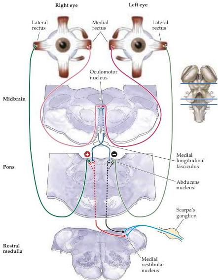

The Vestibular System 329

Figure 13.10 Connections underlying the vestibulo-ocular reflex.
Projections of the vestibular nucleus to the nuclei of cranial nerves III (oculomotor) and VI (abducens).
The connections to the oculomotor nucleus and to the contralateral abducens nucleus are excitatory (red), whereas the connections to ipsilateral abducens nucleus are inhibitory (black).
There are connections from the oculomotor nucleus to the medial rectus of the left eye and from the adducens nucleus to the lateral rectus of the right eye.
This circuit moves the eyes to the right, that is, in the direction away from the left horizontal canal, when the head rotates to the left.
Turning to the right, which causes increased activity in the right horizontal canal, has the opposite effect on eye movements.
The projections from the right vestibular nucleus are omitted for clarity.

that causes the lateral rectus of the right eye to contract; the other is an excitatory projection that crosses the midline and ascends via the medial longitudinal fasciculus to the left oculomotor nucleus, where it activates neurons that cause the medial rectus of the left eye to contract.
Finally, inhibitory neurons project from the medial vestibular nucleus to the left abducens nucleus, directly causing the motor drive on the lateral rectus of the left eye to decrease and also indirectly causing the right medial rectus to relax.
The consequence of these several connections is that excitatory input from the horizontal canal on one side produces eye movements toward the opposite side.
Therefore, turning the head to the left causes eye movements to the right.

In a similar fashion, head turns in other planes activate other semicircular canals, causing other appropriate compensatory eye movements.
Thus, the VOR also plays an important role in vertical gaze stabilization in response to