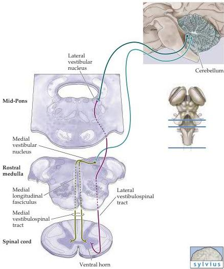

The Vestibular System 331

Figure 13.11 Descending projections from the medial and lateral vestibular nuclei to the spinal cord underlie the VCR and VSR.
The medial vestibular nuclei project bilaterally in the medial longitudinal fasciculus to reach the medial part of the ventral horns and mediate head reflexes in response to activation of semicircular canals.
The lateral vestibular nucleus sends axons via the lateral vestibular tract to contact anterior horn cells innervating the axial and proximal limb muscles.
Neurons in the lateral vestibular nucleus receive input from the cerebellum, allowing the cerebellum to influence posture and equilibrium.

decerebrate rigidity suggests further that the vestibulospinal pathway is normally suppressed by descending projections from higher levels of the brain, especially the cerebral cortex (see also Chapter 16).

## Vestibular Pathways to the Thalamus and Cortex

In addition to these several descending projections, the superior and lateral vestibular nuclei send axons to the ventral posterior nuclear complex of the thalamus, which in turn projects to two cortical areas relevant to vestibular