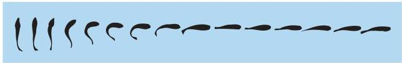

Chapter Thirteen

# Box D

## Mauthner Cells in Fish

A primary function of the vestibular system is to provide information about the direction and speed of ongoing movements, ultimately enabling rapid, coordinated reflexes to compensate for both self-induced and externally generated forces.
One of the most impressive and speediest vestibular-mediated reflexes is the tail-flip escape behavior of fish (and larval amphibians), a stereotyped response that allows a potential prey to elude its predators (Figure A; tap on the side of a fish tank if you want to observe the reflex).
In response to a perceived risk, fish flick their tail and are thus propelled laterally away from the approaching threat.

The circuitry underlying the tail-flip escape reflex includes a pair of giant medullary neurons called Mauthner cells, their vestibular inputs, and the spinal cord motor neurons to which the Mauthner cells project.
(In most fish,

there is one pair of Mauthner cells in a stereotypic location.
Thus, these cells can be consistently visualized and studied from animal to animal.) Movements in the water, such as might be caused by an approaching predator, excite saccular hair cells in the vestibular labyrinth.
These receptor potentials are transmitted via the central processes of vestibular ganglion cells in cranial nerve VIII to the two Mauthner cells in the brainstem.
As in the vestibulo-spinal pathway in humans, the Mauthner cells project directly to spinal motor neurons.
The small number of synapses intervening between the receptor cells and the motor neurons is one of the ways that this circuit has been optimized for speed by natural selection, an arrangement evident in humans as well.
The large size of the Mauthner axons is another; the axons from these cells in a goldfish are about 50  $\mu$ m in diameter.

The optimization for speed and direction in the escape reflex also is reflected in the synapses vestibular nerve afferents make on each Mauthner cell (Figure B).
These connections are electrical synapses that allow rapid and faithful transmission of the vestibular signal.

An appropriate direction for escape is promoted by two features: (1) each Mauthner cell projects only to contralateral motor neurons; and (2) a local network of bilaterally projecting interneurons inhibits activity in the Mauthner cell away from the side on which the vestibular activity originates.
In this way, the Mauthner cell on one side faithfully generates action potentials that command contractions of contralateral tail musculature, thus moving the fish out of the path of the oncoming predator.
Conversely, the Mauthner cell on the opposite side is silenced by the local inhibitory network during the response (Figure C).

(A) Bird's-eye view of the sequential body orientations of a fish engaging in a tail-flip escape behavior, with time progressing from left to right.
This behavior is largely mediated by vestibular inputs to Mauthner cells.

sensations (Figure 13.12).
One of these cortical targets is just posterior to the primary somatosensory cortex, near the representation of the face; the other is at the transition between the somatic sensory cortex and the motor cortex (Brodmann's area 3a; see Chapter 8).
Electrophysiological studies of individual neurons in these areas show that the relevant cells respond to proprioceptive and visual stimuli as well as to vestibular stimuli.
Many of these neurons are activated by moving visual stimuli as well as by rotation of the body (even with the eyes closed), suggesting that these cortical regions are involved in the perception of body orientation in extrapersonal space.
Con