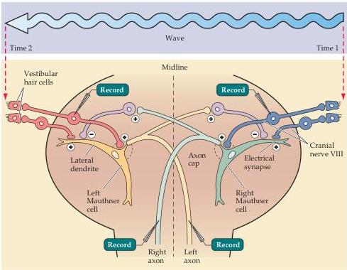
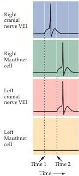

The Vestibular System 333

(B) Diagram of synaptic events in the Mauthner cells of a fish in response to a disturbance in the water coming from the right.
(C) Complementary responses of the right and left Mauthner cells mediating the escape response.
Times 1 and 2 correspond to those indicated in Figure B.
(After Furshpan and Furukuwa, 1962.)

The Mauthner cells in fish are analogous to the reticulospinal and vestibulospinal pathways that control balance, posture, and orienting movements in mammals.
The equivalent behavioral responses in humans are evident in a friendly game of tag, or more serious endeavors.

# References

EATON, R.
C., R.
A.
BOMBARDIERI AND D.
L.
MEYER (1977) The Mauthner-initiated startle response in teleost fish.
J.
Exp.
Biol.
66: 65-81.
FURSHPAN, E.
J.
AND T.
FURUKAWA (1962) Intracellular and extracellular responses of the several regions of the Mauthner cell of the goldfish.
J.
Neurophysiol.
25:732-771.

(C)

JONTES, J.
D., J.
BUCHANAN AND S.
J.
SMITH (2000) Growth cone and dendrite dynamics in zebrafish embryos: Early events in synaptogenesis imaged in vivo.
Nature Neurosci.
3: 231-237.
O'MALLEY, D.
M., Y.
H.
KAO AND J.
R.
FETCHO (1996) Imaging the functional organization of zebrafish hindbrain segments during escape behaviors.
Neuron 17: 1145-1155.

sistent with this interpretation, patients with lesions of the right parietal cortex suffer altered perception of personal and extra-personal space, as discussed in greater detail in Chapter 25.

# Summary

The vestibular system provides information about the motion and position of the body in space.
The sensory receptor cells of the vestibular system are located in the otolith organs and the semicircular canals of the inner ear.
The