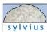
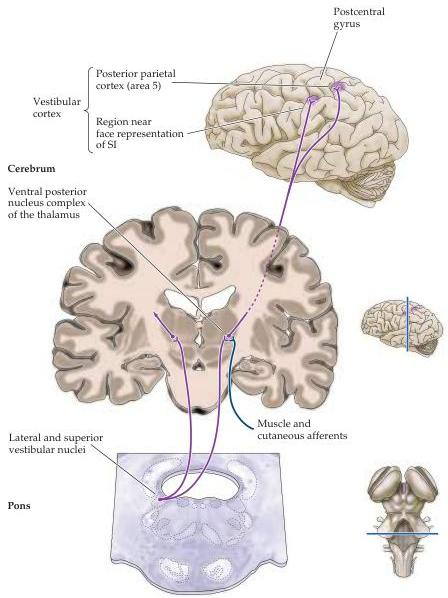

Chapter Thirteen

Figure 13.12 Thalamocortical pathways carrying vestibular information.
The lateral and superior vestibular nuclei project to the thalamus.
From the thalamus, the vestibular neurons project to the vicinity of the central sulcus near the face representation.
Sensory inputs from the muscles and skin also converge on thalamic neurons receiving vestibular input (see Chapter 9).

otolith organs provide information necessary for postural adjustments of the somatic musculature, particularly the axial musculature, when the head tilts in various directions or undergoes linear accelerations.
This information represents linear forces acting on the head that arise through static effects of gravity or from translational movements.
The semicircular canals, in contrast, provide information about rotational accelerations of the head.
This latter information generates reflex movements that adjust the eyes, head, and body during motor activities.
Among the best studied of these reflexes are eye movements that compensate for head movements, thereby stabilizing the visual scene when the head moves.
Input from all the vestibular organs is integrated with input from the visual and somatic sensory systems to provide perceptions of body position and orientation in space.