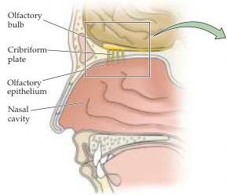
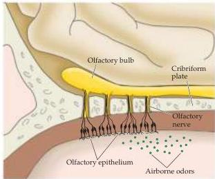
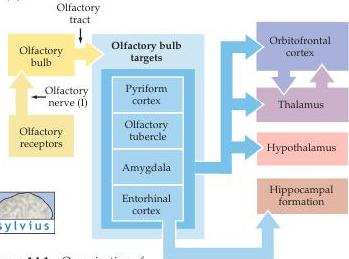
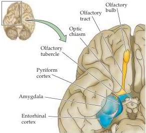
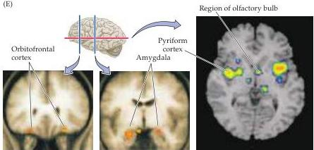

Chapter Fourteen

(A)

(B)

(C)
Figure 14.1 Organization of the human olfactory system.
(A) Peripheral and central components of the primary olfactory pathway.
(B) Enlargement of region boxed in (A) showing the relationship between the olfactory epithelium (which contains the olfactory receptor neurons) and the olfactory bulb (the central target of olfactory receptor neurons).
(C) Diagram of the basic pathways for processing olfactory information.
(D) Central components of the olfactory system.
(E) fMRI images showing focal activity in the regions of the olfactory bulb, pyriform cortex, and amygdala in a normal human being passively smelling odors.
(From Savic et al., 2001.)

(D)

