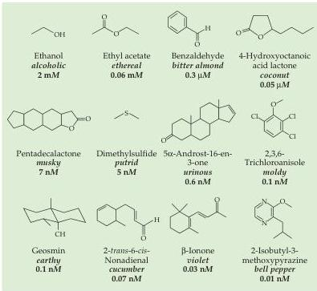
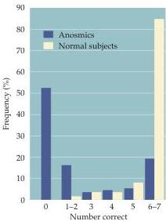

Chapter Fourteen

Figure 14.2 Chemical structure and human perceptual threshold for 12 common odorants.
Molecules perceived at low concentrations are more lipid-soluble, whereas those with higher thresholds are more water-soluble.
(After Pelosi, 1994.)

Figure 14.3 Anosmia is the inability to identify common odors.
When subjects are presented with seven common odors (a test frequently used by neurologists), the vast majority of "normal" individuals can identify all seven odors correctly (in this case, baby powder, chocolate, cinnamon, coffee, mothballs, peanut butter, and soap).
Some people, however, have difficulty identifying even these common odors.
In this example, individuals previously identified as anosmics were presented with the same battery of odors, only a few could identify all of the odors (less than 15%), and more than half could not identify any of the odors.
(After Cain and Gent, in Meiselman and Rivlin, 1986.)

ceive distinct odorant molecules as a particular identifiable smell.
Thus, coconuts, violets, cucumbers, and bell peppers all have a unique odor generated by a specific molecule.
Most naturally occurring odors, however, are blends of several odorant molecules, even though they are typically experienced as a single smell (such as the perceptions elicited by perfumes or the bouquet of a wine).

Psychologists and neurologists have developed a variety of tests that measure the ability to detect common odors.
Although most people are able to consistently identify a broad range of test odorants, others fail to identify one or more common smells (Figure 14.3).
Such chemosensory deficits, called anosmias, are often restricted to a single odorant, suggesting that a specific element in the olfactory system, either an olfactory receptor gene (see below) or genes that control expression or function of a specific odorant receptor gene, is inactivated.
Nevertheless, genetic analysis of anosmic individuals has yet to confirm this possibility.
Anosmias often target perception of distinct, noxious odorants.
About 1 person in 1000 is insensitive to butyl mercaptan, the foul-smelling odorant released by skunks.
More serious is the inability to