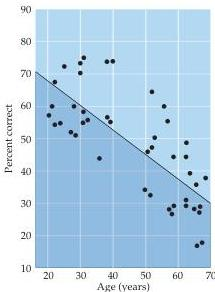

The Chemical Senses 341

detect hydrogen cyanide (1 in 10 people), which can be lethal, or ethyl mercaptan, the chemical added to natural gas to aid in the detection of gas leaks.

The ability to identify odors normally decreases with age.
If otherwise healthy subjects are challenged to identify a large battery of common odorants, people between 20 and 40 years of age can typically identify about 50–75% of the odors, whereas those between 50 and 70 correctly identify only about 30–45% (Figure 14.4).
A more radically diminished or distorted sense of smell can accompany eating disorders, psychotic disorders (especially schizophrenia), diabetes, taking certain medications, and Alzheimer’s disease (all for reasons that remain obscure).
Although the loss of human olfactory sensitivity is not usually a source of great concern, it can diminish the enjoyment of food and, if severe, can affect the ability to identify and respond appropriately to potentially dangerous odors such as spoiled food, smoke, or natural gas.

The neural substrates for odor processing in humans includes all of the structures identified anatomically as part of the olfactory pathway: the olfactory bulb, pyriform and orbital cortices, amygdala and hypothalamus are all clearly activated by presentation of odorants in functional magnetic resonance images (fMRI) of normal human subjects (Figure 14.1E).
Although fMRI cannot resolve differences in the local activity elicited by most individual odors, some clear distinctions have been seen that support corresponding behavioral observations.
Furthermore, the decline in olfactory ability with age mentioned above is matched by a decline in the level of activity in olfactory regions of the aging human brain.

## Physiological and Behavioral Responses to Odorants

In addition to olfactory perceptions, odorants can elicit a variety of physiological responses.
Examples are the visceral motor responses to the aroma of appetizing food (salivation and increased gastric motility) or to a noxious smell (gagging and, in extreme cases, vomiting).
Olfaction can also influence reproductive and endocrine functions.
Women housed in single-sex dormitories, for instance, have menstrual cycles that tend to be synchronized, a phenomenon that appears to be mediated by olfaction.
Volunteers exposed to gauze pads from the underarms of women at different stages of their menstrual cycles also tend to experience synchronized menses, and this synchronization can be disrupted by exposure to gauze pads from men.
Olfaction also influences mother–child interactions.
Infants recognize their mothers within hours after birth by smell, preferentially orienting toward their mothers’ breasts and showing increased rates of suckling when fed by their mother compared to being fed by other lactating females, or when presented experimentally with their mother’s odor versus that of an unrelated female (see Chapter 23).
By the same token, mothers can discriminate their own infant’s odor when challenged with a range of odor stimuli from infants of similar age.

In other animals, including many mammals, species-specific odorants called pheromones play important roles in behavior, by influencing social, reproductive, and parenting behaviors (Box A).
In rats and mice, odorants thought to be pheromones are detected by G-protein-coupled receptors located at the base of the nasal cavity in distinct, encapsulated chemosensory structures called vomeronasal organs (VNOs).
In many mammals, VNOs project to the accessory olfactory bulb, which in turn projects to the hypothalamus (where reproductive activity is generally regulated; see Chapter 29).
VNOs are found bilaterally in only 8% of adult humans, and there is no clear

Figure 14.4 Normal decline in olfactory sensitivity with age.
The ability to identify 80 common odorants declines markedly between 20 and 70 years of age.
(After Murphy, 1986.)