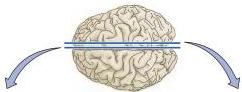
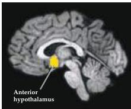
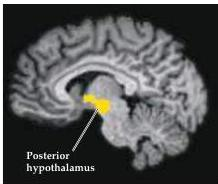

Chapter Fourteen

Figure 14.5 Differential patterns of activation in the hypothalamus of normal human female (right) and male (left) subjects after exposure to an estrogen- or androgen-containing odor mix.
(From Savic et al., 2001.)

(A) Females

(B) Males

indication that these human structures have any significant function.
The human genes encoding homologues of pheromone receptors expressed by VNO neurons in other mammals are mostly pseudogenes (i.e., the sequences have been mutated over the course of evolution so that these genes cannot be expressed).
Thus, it is unlikely that human pheromone perception, if it exists, is mediated by the vomeronasal system, as is the case in other mammals.
Nevertheless, recent observations suggest that exposure to androgen and estrogen-like compounds at concentrations below the level of conscious detection can elicit both behavioral responses and different patterns of brain activation in adult female and male human subjects (Figure 14.5).
Thus, although most humans do not process pheromones by the vomeronasal system, other olfactory structures can evidently detect signals that may affect reproductive and other behaviors.

# The Olfactory Epithelium and Olfactory Receptor Neurons

The transduction of olfactory information occurs in the olfactory epithelium, the sheet of neurons and supporting cells that lines approximately half of the nasal cavities.
(The remaining surface is lined by respiratory epithelium, which lacks neurons and serves primarily as a protective surface.) The olfactory epithelium includes several cell types (Figure 14.6A).
The most important of these is the olfactory receptor neuron, a bipolar cell that gives rise to a small-diameter, unmyelinated axon at its basal surface that transmits olfactory information centrally.
At its apical surface, the receptor neuron gives rise to a single dendritic process that expands into a knoblike protrusion from which several microvilli, called olfactory cilia, extend into a thick layer of mucus.
The mucus that lines the nasal cavity and controls the ionic milieu of the olfactory cilia is produced by secretory specializations (called Bowman's glands) distributed throughout the epithelium.
When the mucus layer becomes thicker, as during a cold, olfactory acuity decreases significantly.
Two other cell classes, basal cells and sustentacular (supporting) cells, are also