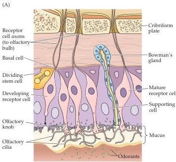
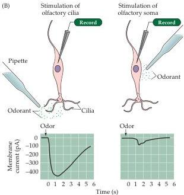

The Chemical Senses 343

present in the olfactory epithelium.
This entire apparatus—mucus layer and epithelium with neural and supporting cells—is called the nasal mucosa.

The superficial location of the nasal mucosa allows the olfactory receptor neurons direct access to odorant molecules.
Another consequence, however, is that these neurons are exceptionally exposed.
Airborne pollutants, allergens, microorganisms, and other potentially harmful substances subject the olfactory receptor neurons to more or less continual damage.
Several mechanisms help maintain the integrity of the olfactory epithelium in the face of this trauma.
The ciliated cells of the respiratory epithelium, a non-neural epithelium found at the most external aspect of the nasal cavity, warms and moistens the inspired air.
In addition, glandular cells throughout the epithelium secrete mucus, which traps and neutralizes potentially harmful agents.
In both the respiratory and olfactory epithelium, immunoglobulins are secreted into the mucus, providing an initial defense against harmful antigens, and the sustentacular cells contain enzymes (cytochrome P450s and others) that catabolize organic chemicals and other potentially damaging molecules that enter the nasal cavity.
The ultimate solution to this problem, however, is to replace olfactory receptor neurons in a normal cycle of degeneration and regeneration.
In rodents, the entire population of olfactory neurons is renewed every 6 to 8 weeks.
This feat is accomplished by maintaining among the basal cells a population of precursors (stem cells) that divide to give rise to new receptor neurons (see Figure 14.6A).
This naturally occurring regeneration of olfactory receptor cells provides an opportunity to investigate how neural precursor cells can successfully produce new neurons and reconstitute function in the mature central nervous system, a topic of broad clinical interest.
Recent evidence suggests that many of the signaling molecules that influence neuronal differentiation, axon outgrowth, and synapse formation during development elsewhere in the nervous system (see Chapters 21 and 22) perform similar functions for regenerating olfactory

Figure 14.6 Structure and function of the olfactory epithelium.
(A) Diagram of the olfactory epithelium showing the major cell types: olfactory receptor neurons and their cilia, sustentacular cells (that detoxify potentially dangerous chemicals), and basal cells.
Bowman's glands produce mucus.
Nerve bundles of unmyelinated neurons and blood vessels run in the basal part of the mucosa (called the lamina propria).
Olfactory receptor neurons are generated continuously from basal cells.
(B) Generation of receptor potentials in response to odors takes place in the cilia of receptor neurons.
Thus, odorants evoke a large inward (depolarizing) current when applied to the cilia (left), but only a small current when applied to the cell body (right).
(A after Anholt, 1987; B after Firestein et al., 1991.)