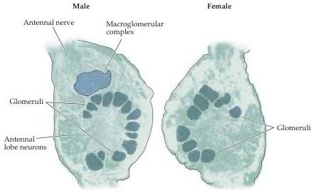

Chapter Fourteen

# Box A

## Olfaction, Pheromones, and Behavior in the Hawk Moth

Olfactory information guides essential behaviors in virtually all species.
The importance of olfactory cues in reproductive behaviors has been particularly well characterized in the hawk moth, *Manduca sexta*.
In *Manduca*, males identify potential mates by following a plume of pheromones exuded by the female.
Similarly, the female uses an olfactory cue—a molecule made by tobacco plants—to identify an appropriate site to lay eggs.
These olfactory functions in the moths are sexually dimorphic: Only males respond to female pheromones, and only females detect the olfactory stimulus from the tobacco plant needed for egg-laying.

These abilities are mediated by an olfactory system that shares some remarkable similarities with mammalian systems.
Male and female moths have different olfactory receptor cells (and associated structures) on their antennae which generate receptor potentials in response to the female-specific pheromones or the tobacco plant odorants.
These peripheral receptors project to olfactory recipient structures that are reminiscent of the mammalian olfactory bulb (see figure).
The target structure in the moth—called the antennal lobe—is comprised of an array of iterated circuits that are referred to as glomeruli and are surprisingly similar in both structure and function to glomeruli in the mammalian olfactory bulb.
In males, the antennal receptor neurons sensitive to the female pheromone project to a distinct subset of glomeruli called the macroglomerular complex.
These glomeruli are specifically active in the presence of female pheromone and, if absent, prevent any behavioral response to the female scent.
Finally, the development of these sexually dimorphic central circuits is controlled by the periphery.
If a male antennae is transplanted to a genotypically female moth, a macroglomerular complex develops in the antennal lobe.
The female-specific pheromone has been identified, as have several receptor molecules specifically associated with the male or female olfactory pathway, respectively.
Not surprisingly, pheromone receptors in the male are members of a special class of seven transmembrane odorant receptors found in other invertebrates and vertebrates.

The matching of identified glomeruli with receptor cells expressing specific receptor molecules may be a general rule in olfactory systems.
If so, the neurobiology of a sexually dimorphic olfactory behavior in the moth provides an ideal model system in which to study chemosensory processing of specific odorants.

## References

FARKAS, S.
R.
AND H.
H.
SHOREY (1972) Chemical trial following by flying insects: A mechanism for orientation to a distant odor source.
Science 178: 67–68.

MATSUMOTO, S.
G.
AND J.
G.
HILDEBRAND (1981) Olfactory mechanisms in the moth *Manduca sexta*: Response characteristics and morphology of central neurons in the antennal lobe.
Proc.
Roy.
Soc.
London B.
213: 249–277.

SCHNEIDERMAN, A.
M., S.
G.
MATSUMOTO AND J.
G.
HILDEBRAND (1982) Trans-sexually grafted antennae influence development of sexually dimorphic neurons in moth brain.
Nature 298: 844–846.

SCHNEIDERMAN, A.
M., J.
G.
HILDEBRAND, M.
M.
BRENNAN AND J.
H.
TUMLINSON (1986) Trans-sexually grafted antennae alter pheromone-directed behavior in a moth.
Nature 323: 801–803.

STRAUSFELD, N.
J.
AND J.
G.
HILDEBRAND (1999) Olfactory systems: Common design, uncommon origin.
Curr.
Opin.
Neurobiol.
9: 634–639.

Male and female olfactory glomeruli in the antennal lobe are specialized for odorant-mediated behaviors.
The male-specific macroglomerular complex (MCG) is essential for processing the female pheromone.