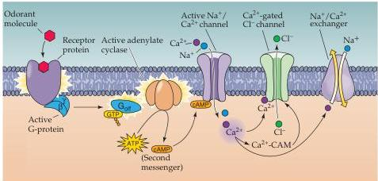
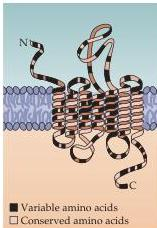

The Chemical Senses 345

receptor neurons in the adult.
Understanding how the new olfactory receptor neurons differentiate into functional neurons, extend axons to the brain, and reestablish appropriate functional connections is obviously relevant to stimulating the regeneration of functional connections elsewhere in the brain after injury or disease (see Chapter 24).

## The Transduction of Olfactory Signals

The cellular and molecular machinery for olfactory transduction is located in the cilia of olfactory receptor neurons (see Figure 14.6B).
Despite their external appearance, olfactory cilia do not have the cytoskeletal features of motile cilia (the so-called $9 + 2$ arrangement of microtubules).
Odorant transduction begins with odorant binding to specific receptors on the external surface of cilia.
Binding may occur directly, or by way of proteins in the mucus (called odorant binding proteins) that sequester the odorant and are thought to shuttle it to the receptor.
Several additional steps then generate a receptor potential by opening ion channels.
In mammals, the principal pathway involves cyclic nucleotide-gated ion channels, similar to those found in rod photoreceptors (see Chapter 10).
The olfactory receptor neurons express an olfactory-specific G-protein $(\mathrm{G}_{\mathrm{olf}})$, which activates an olfactory-specific adenylate cyclase (Figure 14.7A).
Both of these proteins are restricted to the knob and cilia, consistent with the idea that odor transduction occurs in these portions of the olfactory receptor neuron.
Stimulation of odorant receptor molecules leads to an increase in cyclic AMP (cAMP) which opens channels that permit $\mathrm{Na^{+}}$ and $\mathrm{Ca^{2 + }}$ entry (mostly $\mathrm{Ca^{2 + }}$), thus depolarizing the neuron.
This depolarization, amplified by a $\mathrm{Ca^{2 + }}$-activated $\mathrm{Cl^-}$ current, is conducted passively from the cilia to the axon hillock region of the olfactory receptor neuron, where action potentials are generated and transmitted to the olfactory bulb.

Olfactory receptor neurons are especially efficient at extracting a signal from chemosensory noise.
Fluctuations in the cAMP concentration in an olfactory receptor neuron could, in theory, cause the receptor cell to be activated in the absence of odorants.
Such nonspecific responses do not occur, however, because the cAMP-gated channels are blocked at the resting potential by the high $\mathrm{Ca^{2 + }}$ and $\mathrm{Mg^{2 + }}$ concentrations in mucus.
To overcome this

(A)

Figure 14.7 Olfactory transduction and olfactory receptor molecules.
(A) Odorants in the mucus bind directly (or are shuttled via odorant binding proteins) to one of many receptor molecules located in the membranes of the cilia.
This association activates an odorant-specific G-protein $(\mathrm{G}_{\mathrm{olf}})$ that, in turn, activates an adenylate cyclase, resulting in the generation of cyclic AMP (cAMP).
One target of cAMP is a cation-selective channel that, when open, permits the influx of $\mathrm{Na^{+}}$ and $\mathrm{Ca^{2 + }}$ into the cilia, resulting in depolarization.
The ensuing increase in intracellular $\mathrm{Ca^{2 + }}$ opens $\mathrm{Ca^{2 + }}$-gated $\mathrm{Cl^-}$ channels that provide most of the depolarization of the olfactory receptor potential.
The receptor potential is reduced in magnitude when cAMP is broken down by specific phosphodiesterases to reduce its concentration.
At the same time, $\mathrm{Ca^{2 + }}$ complexes with calmodulin $(\mathrm{Ca^{2 + }}$-CAM) and binds to the channel, reducing its affinity for cAMP.
Finally, $\mathrm{Ca^{2 + }}$ is extruded through the $\mathrm{Ca^{2 + }}/\mathrm{Na^{+}}$ exchange pathway.
(B) The generic structure of putative olfactory odorant receptors.
These proteins have seven transmembrane domains, plus a variable cell surface region and a cytoplasmic tail that interacts with G-proteins.
As many as 1000 genes encode proteins of similar inferred structure in several mammalian species, including humans.
Each gene presumably encodes an odorant receptor that detects a particular set of odorant molecules.
(Adapted from Menini, 1999.)

(B)