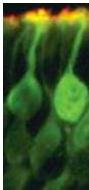
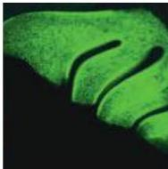
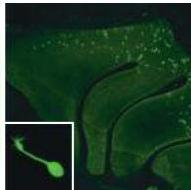
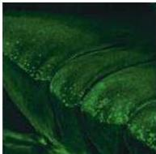

Chapter Fourteen

(A)

(B)

(C)

(D)

Figure 14.9 Odorant receptor gene expression.
(A) Individual olfactory receptor neurons labeled immunohistochemically with the olfactory marker protein OMP (green label; OMP is selective for all olfactory receptor neurons) and the olfactory receptor neuron-specific adenylyl cyclase III (red label) that is limited to cilia.
The labels are in register with the segregation of signal transduction components to this domain.
(B) The distribution of OMP-expressing olfactory receptor neurons in the nasal epithelium of an adult mouse, demonstrated with a reporter transgene.
The protuberances oriented diagonally from left to right represent individual turbinates within the olfactory epithelium.
The remaining bony and soft-tissue structures of the nose have been dissected away.
(C) The distribution of olfactory receptor neurons expressing the I7 odorant receptor.
These cells are restricted to a distinct domain or zone in the epithelium.
The inset photo shows that odorant receptor-expressing cells are indeed cilia-bearing olfactory receptor neurons.
(D) Olfactory receptor neurons expressing the M81 odorant receptor are limited to a zone that is completely distinct from that of the I7 receptor.
(A courtesy of C.
Balmer and A.
LaMantia; B-D from Bozza et al., 2002.)

Additional sequence analysis of human and mouse odorant receptor genes, however, suggests that many—around 60% in human and 20% in mouse—are not transcribed.
Thus, the numbers of functional odorant receptor proteins are estimated to be around 400 in humans and 1200 in mice.
Similar analysis of complete genome sequences from the worm C.
elegans and the fruit fly D.
melanogaster indicate that there are approximately 1000 odorant receptor genes in the worm, but only about 60 in the fruit fly.
The significance of these quite different numbers of odorant receptor genes is not known.

Due to the large number of odorant receptor genes, expression in olfactory receptor neurons has only been confirmed for a limited subset (Figure 14.9).
Messenger RNAs for different odorant receptor genes are expressed in subsets of olfactory neurons that occur in bilaterally symmetric patches of olfactory epithelium.
Additional evidence for odorant receptor gene expression comes from molecular genetic experiments where reporter proteins like β-galactosidase or green fluorescent protein have been inserted into odorant receptor gene loci.
In these experiments (done primarily in mice and fruit flies) expression of the reporter protein is limited to individual olfactory receptor neurons and their processes in distinct regions of the olfactory epithelium.
Genetic as well as cell biological analysis shows that each olfactory receptor neuron expresses only one or at most a few odorant receptor genes.
Thus, different odors must activate molecularly and spatially distinct subsets of olfactory receptor neurons.

## Olfactory Coding

Like other sensory receptor cells, individual olfactory receptor neurons are sensitive to a subset of stimuli.
Presumably, depending on the particular olfactory receptor molecules they express, some olfactory receptor neurons exhibit marked selectivity to a particular chemical stimulus, whereas others are activated by a number of different odorant molecules (Figure 14.10A).
In addition, olfactory receptor neurons can exhibit different thresholds for a particular odorant.
That is, receptor neurons that are inactive at concentrations sufficient to stimulate some neurons are activated when exposed to higher concentrations of the same odorant.
These characteristics suggest