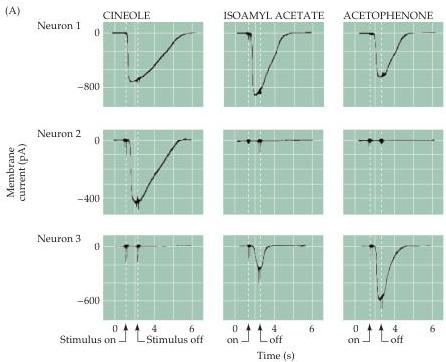
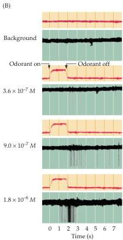

The Chemical Senses 349

why the perception of an odor can change as a function of its concentration (Figure 14.10B).
The relationship between physiological tuning of single olfactory receptor neurons and chemical specificity of single odorant receptor molecules remains unclear.
At present, there is only one mammalian odorant receptor molecule, the I7 receptor, whose ligand specificity has been evaluated.
This receptor has a high affinity for the aldehyde $n$-octanal, as well as some affinity for related molecules.
While most of the molecular analysis has been done in rodents, humans can perceive $n$-octanal—it smells like freshly cut grass.
Thus, it is possible that ligands for other individual odorant receptors eventually will be found, and these ligands will correspond to perceptually relevant odors.

How olfactory receptor neurons represent the identity and concentration of a given odorant is a complex issue that is unlikely to be explained solely by the properties of the primary receptor neurons.
Nevertheless, neurons with specific receptors are located in particular parts of the olfactory epithelium.
As in other sensory systems, the topographical arrangement of receptor neurons expressing distinct odorant receptor molecules is referred to as space coding, although the meaning of this phrase in the olfactory system is much less clear than in vision, where a topographical map correlates with visual space.
The coding of olfactory information also has a temporal dimension.
Sniffing, for instance, is a periodic event that elicits trains of action potentials and synchronous activity in populations of neurons.
Information conveyed by timing is called temporal coding and occurs in a variety of species (Box B).
The contribution of spatial or temporal coding to olfactory perception is not yet known.

Figure 14.10 Responses of olfactory receptor neurons to selected odorants.
(A) Neuron 1 responds similarly to three different odorants.
In contrast, neuron 2 responds to only one of these odorants.
Neuron 3 responds to two of the three stimuli.
The responses of these receptor neurons were recorded by whole-cell patch clamp recording; downward deflections represent inward currents measured at a holding potential of $-55$ mV.
(B) Responses of a single olfactory receptor neuron to changes in the concentration of a single odorant, isoamyl acetate.
The upper trace in each panel (red) indicates the duration of the odorant stimulus; the lower trace the neuronal response.
The frequency and number in each panel of action potentials increases as the odorant concentration increases.
(A after Firestein, 1992; B after Getchell, 1986.)