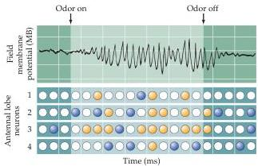

Chapter Fourteen

# Box B

## Temporal "Coding" of Olfactory Information in Insects

Most studies of olfaction in mammals have emphasized the spatial patterns of receptors in the nose and glomeruli in the bulb that are activated by specific odorants.
However, beginning with Edgar Adrian's study of the hedgehog olfactory bulb in 1942, odor-induced temporal oscillations have been described in species as diverse as turtles and primates.
A variety of functions have been proposed for these oscillatory phenomena, including identification of odor type and perception of odor intensity.

Gilles Laurent and colleagues at California Institute of Technology have recently found that olfaction in insects does show an important temporal component related to behavior.
By recording intracellularly from neurons in the antennal lobe in crickets (a structure analogous to the olfactory bulb in mammals; see also Box A) and extracellularly in the mushroom body (analogous to the mammalian pyriform cortex), they found that

the projection neurons in the antennal lobe (corresponding to mammalian mitral cells) respond to a given odor with a variety of temporal patterns that differ from odor to odor but are reproducible for the same odor.
The figure here shows a schematic representation of these temporal aspects of the odor response of four such projection neurons.
The upper panel shows a local field potential recording from the mushroom body (MB) that represents the synaptic activity of many neurons.
During presentation of the odor, a pattern of activity is generated by the synchronized firing of many projection neurons.
Interestingly, this oscillation at $20 - 30\mathrm{Hz}$ is independent of the odor.
Each small sphere in the lower panels represents the state of one of the four neurons before, during, and after the application of an odorant.
White balls represents a silent or inhibited state, blue balls an active but unsynchronized state, and orange balls an active and synchro

Temporal coding of olfactory information in insects.
(From Laurent et al., 1996.)

ized state.
The figure shows that at different times during the odor presentation, various neurons are in synchrony and thus contribute at different times to the field potential recorded in the mushroom body.
Desynchronizing the neurons has the effect of eliminating the $20 - 30\mathrm{Hz}$ oscillation.
Desynchronization does not modify the insects' responses to odors, but eliminates their ability to distinguish among similar odors.

These observations suggest that coherent firing among neurons is an important component of olfactory processing in this species, and raise the possibility that temporal coding is a more important aspect of mammalian olfaction than has so far been imagined.

## References

ADRIAN, E.
D.
(1942) Olfactory reactions in the brain of the hedgehog.
J.
Physiol.
(Lond.) 100: 459-473.
FREEMAN, W.
J.
AND K.
A.
GRADJSKI (1987) Relation of olfactory EEG to behavior: Factor analysis.
Behav.
Neurosci.
101: 766-777.
KAY L.
M.
AND G.
LAURENT (1999) Odor- and context-dependent modulation of mitral cell activity in behaving rats.
Nature Neurosci.
2: 1003-1009.
LAM, Y.-W., L.
B.
COHEN, M.
WACHOWIAK AND M.
R.
ZOCHOWSKI (2000) Odors elicit three different oscillations in the turtle olfactory bulb.
J.
Neurosci.
202: 749-762.
LAURENT, G.
(1999) A systems perspective on early olfactory coding.
Science 286: 723-728.
LAURENT, G., M.
WEHR AND H.
DAVIDOWITZ (1996) Temporal representation of odors in an olfactory network.
J.
Neurosci.
15: 3837-3847.
STOFFER, M.
AND G.
LAURENT (1999) Short-term memory in olfactory network dynamics.
Nature 402: 664-668.

## The Olfactory Bulb

Transducing and relaying odorant information centrally from olfactory receptor neurons are only the first steps in processing olfactory signals.
As the olfactory receptor axons leave the olfactory epithelium, they coalesce to form a large number of bundles that together make up the olfactory nerve