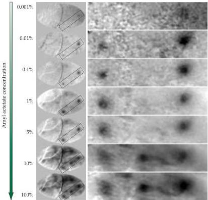

Chapter Fourteen

Figure 14.12 Glomerular activity recorded by optical imaging (see Box C in Chapter 11).
Dorsal surface of the olfactory bulb in a living rat monitored as increasing concentrations of amyl acetate are presented to the animal.
The higher the concentration, the more intense the activity in the particular glomeruli that respond to the odor.
The column at left shows the entire dorsal surface of the olfactory bulb; the column at right shows a higher magnification of the individual glomeruli (indicated by the box in the left-hand column).
(From Rubin and Katz, 1999.)

the temporal lobe near the optic chiasm.
Neurons in pyriform cortex respond to odors, and mitral cell inputs from glomeruli receiving odorant receptor-specific projections remain partially segregated.
The further processing that occurs in this region, however, is not well understood.

The axons of pyramidal cells in the pyriform cortex project in turn to several thalamic and hypothalamic nuclei and to the hippocampus and amygdala.
Some neurons from pyriform cortex also innervate a region in the orbitofrontal cortex comprising multimodal neurons that respond to olfactory and gustatory stimuli.
Information about odors thus reaches a variety of forebrain regions, allowing olfactory cues to influence cognitive, visceral, emotional, and homeostatic behaviors.

# The Organization of the Taste System

The taste system, acting in concert with the olfactory and trigeminal systems, indicates whether food should be ingested.
Once in the mouth, the chemical constituents of food interact with receptors on taste cells located in epithelial specializations called taste buds in the tongue.
The taste cells transduce these stimuli and provide additional information about the identity, concentration, and pleasant or unpleasant quality of the substance.
This information also prepares the gastrointestinal system to receive food by causing salivation and swallowing (or gagging and regurgitation if the substance is unpleasant).
Information about the temperature and texture of food is transduced and relayed from the mouth via somatic sensory receptors from the trigeminal and other sensory cranial nerves to the thalamus and somatic sensory cortices (see Chapters 8 and 9).
Of course, food is not simply