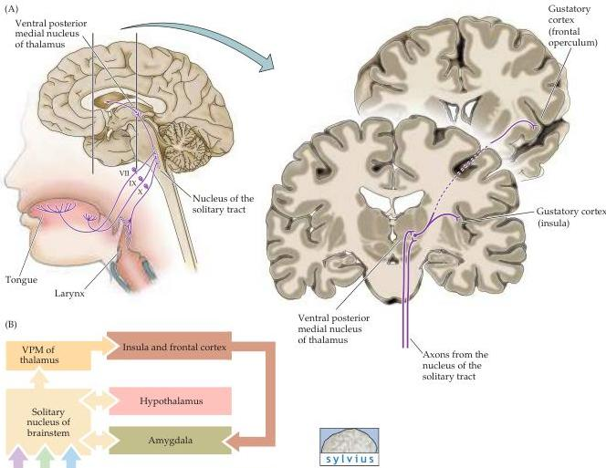

The Chemical Senses 355

eaten for nutritional value; "taste" also depends on cultural and psychological factors.
How else can one explain why so many people enjoy consuming hot peppers or bitter-tasting liquids such as beer?

Like the olfactory system, the taste system includes both peripheral receptors and a number of central pathways (Figure 14.13).
Taste cells (the peripheral receptors) are found in taste buds distributed on the dorsal surface of the tongue, soft palate, pharynx, and the upper part of the esophagus (Figure 14.13A; see also Figure 14.14).
These cells make synapses with primary sensory axons that run in the chorda tympani and greater superior petrosal branches of the facial nerve (cranial nerve VII), the lingual branch of the glossopharyngeal nerve (cranial nerve IX), and the superior laryngeal branch

Figure 14.13 Organization of the human taste system.
(A) Drawing on the left shows the relationship between receptors in the oral cavity and upper alimentary canal, and the nucleus of the solitary tract in the medulla.
The coronal section on the right shows the VPM nucleus of the thalamus and its connection with gustatory regions of the cerebral cortex.
(B) Diagram of the basic pathways for processing taste information.