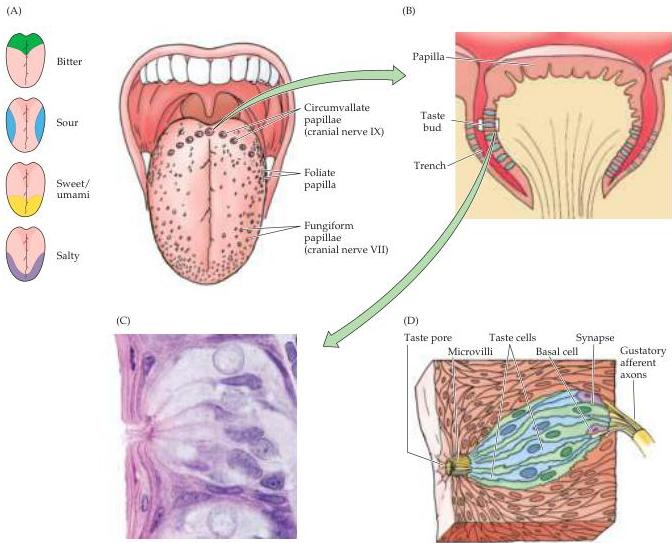

Chapter Fourteen

Figure 14.14 Taste buds and the peripheral innervation of the tongue.
(A) Distribution of taste papillae on the dorsal surface of the tongue.
Different responses to sweet, salty, sour, and bitter tastants recorded in the three cranial nerves that innervate the tongue and epiglottis are indicated at left.
(B) Diagram of a circumvallate papilla showing location of individual taste buds.
(C) Light micrograph of a taste bud.
(D) Diagram of a taste bud, showing various types of taste cells and the associated gustatory nerves.
The apical surface of the receptor cells have microvilli that are oriented toward the taste pore.
(C from Ross, Rommell and Kaye, 1995.)

a recessive (non-tasters) allele.
Interestingly, people who are extremely sensitive to PTC or its analogues—so-called called "supertasters"—have more taste buds than normal and tend to avoid certain foods such as grapefruit, green tea, and broccoli, all of which contain bitter-tasting compounds.
Thus, an individual's genetic makeup with respect to taste receptors has implications for diet, and even health.

The relationship between taste perception and the molecular character of tastants is also variable.
A number of quite different compounds taste sweet to humans.
These include saccharides (glucose, sucrose, and fructose), organic anions (saccharin), amino acids (aspartame, or Nutra-sweet®), L-phenylalanine methyl ester, and proteins (monellin and thaumatin).
People can distinguish among different sweeteners, and some find saccharin to have a bitter-tasting component.
One reason for such discrimination is that some of these compounds activate separate receptors.
For example, saccharides activate cAMP pathways, whereas nonsac