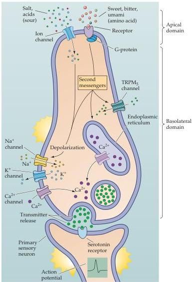

The Chemical Senses 361

Figure 14.15 Basic components of sensory transduction in taste cells.
Taste cells are polarized epithelial cells with an apical and a basolateral domain separated by tight junctions.
Tastant-transducing channels (salt and sour) and G-protein-coupled receptors (sweet, amino acid, and bitter) are limited to the apical domain.
Intracellular signaling components that are coupled to taste receptor molecules (G-proteins and various second messenger-related molecules) are also enriched in the apical domain.
Voltage-regulated Na⁺, K⁺, and Ca²⁺ channels that mediate release of neurotransmitter from presynaptic specializations at the base of the cell onto terminals of peripheral sensory afferents are limited to the basolateral domain, as is endoplasmic reticulum that also modulates intracellular Ca²⁺ concentration and contributes to the release of neurotransmitter.
The neurotransmitter serotonin, among others, is found in taste cells, and serotonin receptors are found on the sensory afferents.
Finally, the TRPM₅ channel, which facilitates G-protein-coupled receptor-mediated depolarization, is expressed in taste cells.
Its localization to apical versus basal domains is not yet known.

coded by 30 genes in humans and other mammals, and multiple T2R subtypes are expressed in single taste cells.
Nevertheless, T2R receptors are not expressed in the same taste cells as T1R1, 2, and 3 receptors.
Thus, the receptor cells for bitter tastants are presumably a distinct class.
Although the transduction of bitter stimuli relies on a similar mechanism to that for sweet and amino acid tastes, a taste cell-specific G-protein, gustducin, is found primarily in T2R-expressing taste cells and apparently contributes to the transduction of bitter tastes.
The remaining steps in bitter transduction are similar to those for sweet and amino acids: PLCβ2-mediated activation of TRPM₅ channels depolarizes the taste cell, resulting in the release of neurotransmitter at the synapse between the taste cell and sensory ganglion cell axon.