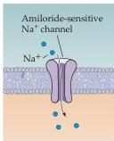
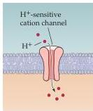
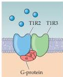
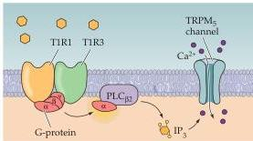
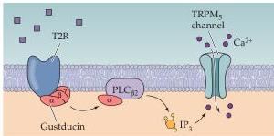

Chapter Fourteen

Figure 14.16 Molecular mechanisms of taste transduction via ion channels and G-protein-coupled receptors.
Cation selectivity of the amiloride-sensitive  $\mathrm{Na^{+}}$  versus the  $\mathrm{H^{+}}$ -sensitive proton channel provides the basis for specificity of salt and sour tastes.
In each case, positive current via the cation channel leads to depolarization of the cell.
For sweet, amino acid (umami), and bitter tastants, different classes of G-protein-coupled receptors mediate transduction.
For sweet tastants, heteromeric complexes of the T1R2 and T1R3 receptors transduce stimuli via a  $\mathrm{PLC}_{\beta 2}$ -mediated,  $\mathrm{IP}_3$ -dependent mechanism that leads to activation of the  $\mathrm{TRPM}_5\mathrm{Ca}^{2+}$  channel.
For amino acids, heteromeric complexes of T1R1 and T1R3 receptors transduce stimuli via the same  $\mathrm{PLC}_{\beta 2} / \mathrm{IP}_3 / \mathrm{TRPM}_5$ -dependent mechanism.
Bitter tastes are transduced via a distinct set of G-protein-coupled receptors, the T2R receptor subtypes.
The details of T2R receptors are less well established; however, they apparently associate with the taste cell-specific G-protein gustducin, which is not found in sweet or amino acid receptor-expressing taste cells.
Nevertheless, stimulus-coupled depolarization for bitter tastes relies upon the same  $\mathrm{PLC}_{\beta 2} / \mathrm{IP}_3 / \mathrm{TRPM}_5$ -dependent mechanism used for sweet and amino acid taste transduction.

Salt
Acids (sour)

Sweet

Amino acids (umami)

Bitter

# Neural Coding in the Taste System

In the taste system, neural coding refers to the way that the identity, concentration, and "hedonic" (pleasurable or aversive) value of tastants is represented in the pattern of action potentials relayed to the brain.
Neurons in the taste system (or in any other sensory system) might be specifically "tuned" to respond with a maximal change in electrical activity to a single taste stimulus.
Such tuning is thought to rely on specificity at the level of the receptor cells, as well as on the maintenance of separate channels for the relay of this information from the periphery to the brain.
This sort of coding scheme is referred to as a labeled line code, since responses in specific cells presumably correspond to distinct stimuli.
The segregated expression of sweet, amino acid, and bitter receptors in different taste cells (Figure 14.17) is consistent with labeled line coding.