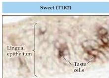
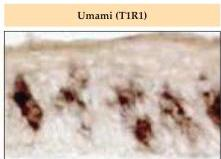
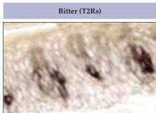
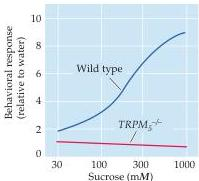
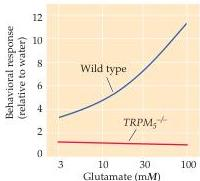
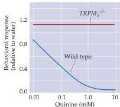
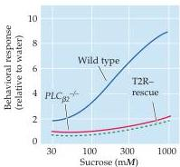
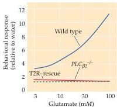
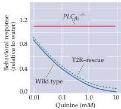

Chapter Fourteen

(A)

(B)

(C)

(D)

(E)

(F)

(G)

(H)

(I)

activated by chemicals classified as irritants, including air pollutants (e.g., sulfur dioxide), ammonia (smelling salts), ethanol (liquor), acetic acid (vinegar), carbon dioxide (in soft drinks), menthol (in various inhalants sensation; see Box A in Chapter 9), and capsaicin (the compound in hot chili peppers that elicits the characteristic burning sensation).
Irritant-sensitive polymodal nociceptors alert the organism to potentially harmful chemical stimuli that have been ingested, respired, or come in contact with the face, and are closely tied to the trigeminal pain system discussed in Chapter 9.

Trigeminal chemosensory information from the face, scalp, cornea, and mucous membranes of the oral and nasal cavities is relayed via the three major sensory branches of the trigeminal nerve: the ophthalmic, maxillary,