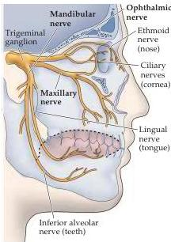

The Chemical Senses 365

$\triangleleft$ Figure 14.17 Specificity in peripheral taste coding supports the labeled line hypothesis.
(A–C) Sweet (A), amino acid (B), and bitter (C) receptors are expressed in different subsets of taste cells.
(D–E) The gene for the TRPM₅ channel can be inactivated, or “knocked out,” in mice (TRPM₅⁻/⁻) and behavioral responses measured with a taste preference test.
The mouse is presented with two drinking spouts, one with water and the other with a tastant; behavioral responses are measured as the frequency of licking of the two spouts.
For pleasant tastes like sweet (sucrose; D) or umami (glutamate; E) control mice lick the spout with the tastant more frequently, and higher concentrations of tastant leads to increased response (blue lines).
In TRPM₅⁻/⁻ mice, this behavioral response (i.e., a preference for the tastant versus water) is eliminated at all concentrations (red lines).
(F) For an aversive tastant like bitter quinine, control mice prefer water.
This behavioral response—which is initially low—is further diminished with higher quinine concentrations (blue line).
Inactivation of TRPM₅ also eliminates this behavioral response, regardless of tastant concentration (red line).
(G–I) When the PLCβ₂ gene is knocked out, behavioral response to (G) sucrose, (H) glutamate, and (I) quinine are eliminated (red lines).
When PLCβ₂ is re-expressed only in T2R-expressing taste cells, behavioral responses to sucrose and glutamate are not rescued (dotted green lines in G and H); however, the behavioral response to quinine is restored to normal levels (compare the blue and dotted green lines in I).
(After Zhang et al., 2003.)

and mandibular (Figure 14.18).
The central target of these afferent axons is the spinal component of the trigeminal nucleus, which relays this information to the ventral posterior medial nucleus of the thalamus and thence to the somatic sensory cortex and other cortical areas that process facial irritation and pain (see Chapter 9).

Many compounds classified as irritants can also be recognized as odors or tastes; however, the threshold concentrations for trigeminal chemoreception are much higher than those for olfaction or taste.
When potentially irritating compounds are presented to people who have lost their sense of smell, perceptual thresholds are found to be approximately 100 times higher than those of normal subjects who perceive the compounds as odors (Figure 14.19).
Similar differences occur in identifying chemicals as tastes rather than irritants.
Thus, 0.1 M NaCl has a salty taste, but 1.0 M NaCl is perceived as an irritant.
Another common irritant is ethanol.
When placed on the tongue at moderate temperatures and high concentrations—as in drinking vodka “neat”—ethanol produces a burning sensation.

A variety of physiological responses mediated by the trigeminal chemosensory system are triggered by exposure to irritants.
These include increased salivation, vasodilation, tearing, nasal secretion, sweating, decreased respiratory rate, and bronchoconstriction.
Consider, for instance, the experience that follows the ingestion of capsaicin (see Box A in Chapter 9).
These reactions are generally protective in that they dilute the stimulus (tearing, salivation, sweating) and prevent inhaling or ingesting more of it.

The receptors for irritants are primarily on the terminal branches of polymodal nociceptive neurons, as described for the pain and temperature systems in Chapter 9.
Although these receptors respond to many of the same stimuli as olfactory receptor neurons (e.g., aldehydes, alcohols), they are probably not activated by the same mechanism; for instance, the G-protein-coupled receptors for odorants are found only in olfactory receptor neurons.
With the exception of capsaicin and acidic stimuli, both of which activate cation-selective ion channels, little is known about the transduction mechanisms for irritants, or their central processing.

Figure 14.18 Diagram of the branches of the trigeminal nerve that innervate the oral, nasal, and ocular cavities.
The chemosensitive structures innervated by each trigeminal branch are indicated in parentheses.