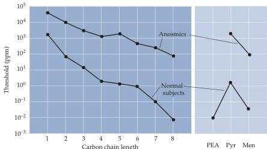

Chapter Fourteen

Figure 14.19 Perceptual thresholds in anosmic and normal subjects for related organic chemicals.
In anosmics, these chemicals are only detected as irritants at relatively high concentrations (indicated here in parts per million, ppm); in normal subjects, they are first detected at much lower concentrations as odors.
The numbers 1-8 stand for the aliphatic alcohols from methanol to 1-octanol.
Perceptual thresholds for three additional common irritants—phenylethyl alcohol (PEA), pyridine (Pyr), and menthol (Men)—are shown at the far right.
(After Commetto-Muniz and Cain, 1990.)

## Summary

The chemical senses—olfaction, taste, and the trigeminal chemosensory system—all contribute to sensing airborne or soluble molecules from a variety of sources.
Humans and other mammals rely on this information for behaviors as diverse as attraction, avoidance, reproduction, feeding, and avoiding potentially dangerous circumstances.
Receptor neurons in the olfactory epithelium transduce chemical stimuli into neuronal activity via the stimulation of G-protein-linked receptors; this interaction leads to elevated levels of second messengers such as cAMP, which in turn open cation-selective channels.
These events generate receptor potentials in the membrane of the olfactory receptor neuron, and ultimately action potentials in the afferent axons of these cells.
Taste receptor cells, in contrast, use a variety of mechanisms for transducing chemical stimuli.
These include ion channels that are directly activated by salts and amino acids, and G-protein-linked receptors that activate second messengers.
For both smell and taste, the spatial and temporal patterns of action potentials provide information about the identity and intensity of chemical stimuli.
The trigeminal chemosensory system responds to irritants by means of mechanisms that are less well understood.
Each of the approximately 10,000 odors that humans recognize (and an undetermined number of tastes and irritant molecules) is evidently encoded by the activity of a distinct population of receptor cells in the nose, tongue, and oral cavity.
Olfaction, taste, and trigeminal chemosensation all are relayed via specific pathways in the central nervous system.
Receptor neurons in the olfactory system project directly to the olfactory bulb.
In the taste system, information is relayed centrally by cranial sensory ganglion cells to the solitary nucleus in the brainstem.
In the trigeminal chemosensory system, information is relayed via trigeminal ganglion cell projections to the spinal trigeminal nucleus in the brainstem.
Each of these structures project in turn to many sites in the brain that process chemosensory information in ways that give rise to some of the most sublime pleasures that humans experience.