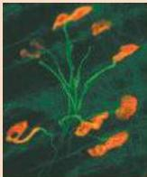

Fluorescence photomicrograph showing motor axons (green) and neuromuscular synapses (orange) in transgenic mice that have been genetically engineered to express fluorescent proteins.
(Courtesy of Bill Snider and Jeff Lichtman.)

# UNIT III

# MOVEMENT AND ITS CENTRAL CONTROL

15 Lower Motor Neuron Circuits and Motor Control
16 Upper Motor Neuron Control of the Brainstem and Spinal Cord
17 Modulation of Movement by the Basal Ganglia
18 Modulation of Movement by the Cerebellum
19 Eye Movements and Sensory Motor Integration
20 The Visceral Motor System

Movements, whether voluntary or involuntary, are produced by spatial and temporal patterns of muscular contractions orchestrated by the brain and spinal cord.
Analysis of these circuits is fundamental to an understanding of both normal behavior and the etiology of a variety of neurological disorders.
This unit considers the brainstem and spinal cord circuitry that make elementary reflex movements possible, as well as the circuits that organize the intricate patterns of neural activity responsible for more complex motor acts.
Ultimately, all movements produced by the skeletal musculature are initiated by "lower" motor neurons in the spinal cord and brainstem that directly innervate skeletal muscles; the innervation of visceral smooth muscles is separately organized by the autonomic divisions of the visceral motor system.

The lower motor neurons are controlled directly by local circuits within the spinal cord and brainstem that coordinate individual muscle groups, and indirectly by "upper" motor neurons in higher centers that regulate those local circuits, thus enabling and coordinating complex sequences of movements.
Especially important are circuits in the basal ganglia and cerebellum that regulate the upper motor neurons, ensuring that movements are performed with spatial and temporal precision.

Specific disorders of movement often signify damage to a particular brain region.
For example, clinically important and intensively studied neurodegenerative disorders such as Parkinson's disease, Huntington's disease, and amyotrophic lateral sclerosis result from pathological changes in different parts of the motor system.
Knowledge of the various levels of motor control is essential for understanding, diagnosing, and treating these diseases.