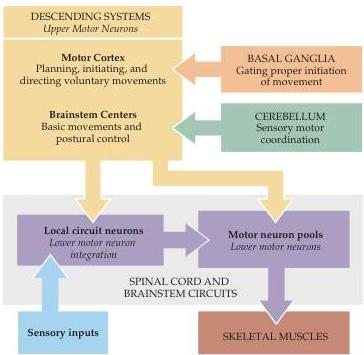

Chapter Fifteen

Figure 15.1 Overall organization of neural structures involved in the control of movement.
Four systems—local spinal cord and brainstem circuits, descending modulatory pathways, the cerebellum, and the basal ganglia—make essential and distinct contributions to motor control.

essential for organized movement.
Even after the spinal cord is disconnected from the brain in an experimental animal such as a cat, appropriate stimulation of local spinal circuits elicits involuntary but highly coordinated limb movements that resemble walking.

The second motor subsystem consists of the upper motor neurons whose cell bodies lie in the brainstem or cerebral cortex and whose axons descend to synapse with the local circuit neurons or, more rarely, with the lower motor neurons directly.
The upper motor neuron pathways that arise in the cortex are essential for the initiation of voluntary movements and for complex spatiotemporal sequences of skilled movements.
In particular, descending projections from cortical areas in the frontal lobe, including Brodmann's area 4 (the primary motor cortex), the lateral part of area 6 (the lateral premotor cortex), and the medial part of area 6 (the medial premotor cortex) are essential for planning, initiating, and directing sequences of voluntary movements.
Upper motor neurons originating in the brainstem are responsible for regulating muscle tone and for orienting the eyes, head, and body with respect to vestibular, somatic, auditory, and visual sensory information.
Their contributions are thus critical for basic navigational movements, and for the control of posture.

The third and fourth subsystems are complex circuits with output pathways that have no direct access to either the local circuit neurons or the lower motor neurons; instead, they control movement by regulating the activity of the upper motor neurons.
The third and larger of these subsystems, the cerebellum, is located on the dorsal surface of the pons (see Chapter 1).
The cerebellum acts via its efferent pathways to the upper motor neurons as a servomechanism, detecting the difference, or "motor error," between an intended movement and the movement actually performed (see Chapter 19).
The cerebellum uses this information about discrepancies to