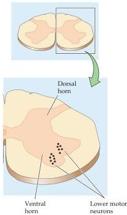
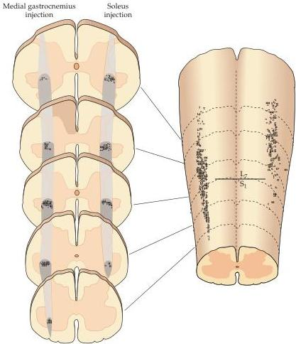

Chapter Fifteen

(A)
Figure 15.2 Organization of lower motor neurons in the ventral horn of the spinal cord demonstrated by labeling of their cell bodies following injection of a retrograde tracer in individual muscles.
Neurons were identified by placing a retrograde tracer into the medial gastrocnemius or soleus muscle of the cat.
(A) Section through the lumbar level of the spinal cord showing the distribution of labeled cell bodies.
Lower motor neurons form distinct clusters (motor pools) in the ventral horn.
Spinal cord cross sections (B) and a reconstruction seen from the dorsal surface (C) illustrate the distribution of motor neurons innervating individual skeletal muscles in both axes of the cord.
The cylindrical shape and distinct distribution of different pools are especially evident in the dorsal view of the reconstructed cord.
The dashed lines in (C) represent individual lumbar and sacral spinal cord segments.
(After Burke et al., 1977.)

(B)

tion with the nerve fibers that innervate them, are actually sensory receptors called muscle spindles (see Chapter 8).
The muscle spindles are embedded within connective tissue capsules in the muscle, and are thus referred to as intrafusal muscle fibers (fusal means capsular).
The intrafusal muscle fibers are also innervated by sensory axons that send information to the brain and spinal cord about the length and tension of the muscle.
The function of the  $\gamma$  motor neurons is to regulate this sensory input by setting the intrafusal muscle fibers to an appropriate length (see the next section).
The second type of lower motor neuron, called  $\alpha$  motor neurons, innervates the extrafusal muscle fibers, which are the striated muscle fibers that actually generate the forces needed for posture and movement.

Although the following discussion focuses on the lower motor neurons in the spinal cord, comparable sets of motor neurons responsible for the control of muscles in the head and neck are located in the brainstem.
The latter neurons are distributed in the eight motor nuclei of the cranial nerves in the medulla, pons, and midbrain (see Appendix A).
Somewhat confusingly, but quite appropriately, these motor neurons in the brainstem are also called lower motor neurons.