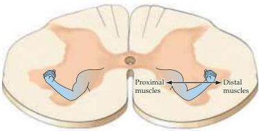
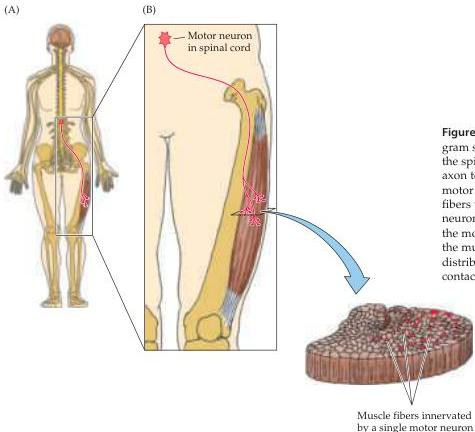

Lower Motor Neuron Circuits and Motor Control 375

Figure 15.3 Somatotopic organization of lower motor neurons in a cross section of the ventral horn at the cervical level of the spinal cord.
Motor neurons innervating axial musculature are located medially, whereas those innervating the distal musculature are located more laterally.

## The Motor Unit

Most mature extrafusal skeletal muscle fibers in mammals are innervated by only a single $\alpha$ motor neuron.
Since there are by far more muscle fibers than motor neurons, individual motor axons branch within muscles to synapse on many different fibers that are typically distributed over a relatively wide area within the muscle, presumably to ensure that the contractile force of the motor unit is spread evenly (Figure 15.4).
In addition, this arrangement reduces the chance that damage to one or a few $\alpha$ motor neurons will significantly alter a muscle's action.
Because an action potential generated by a

Figure 15.4 The motor unit.
(A) Diagram showing a lower motor neuron in the spinal cord and the course of its axon to its target muscle.
(B) Each motor neuron synapses with multiple fibers within the muscle.
The motor neuron and the fibers it contacts define the motor unit.
Cross section through the muscle shows the relatively diffuse distribution of muscle fibers (red dots) contacted by the motor neuron.