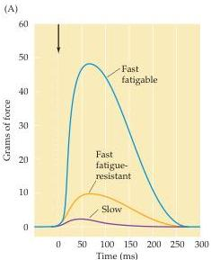
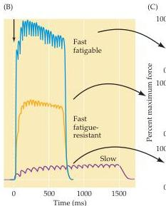
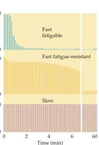

Chapter Fifteen

Figure 15.5 Comparison of the force and fatigability of the three different types of motor units.
In each case, the response reflects stimulation of a single motor neuron.
(A) Change in muscle tension in response to a single motor neuron action potential.
(B) Tension in response to repetitive stimulation of the motor neurons.
(C) Response to repeated stimulation at a level that evokes maximum tension.
The ordinate represents the force generated by each stimulus.
Note the strikingly different fatigue rates.
(After Burke et al., 1974.)

motor neuron normally brings to threshold all of the muscle fibers it contacts, a single $\alpha$ motor neuron and its associated muscle fibers together constitute the smallest unit of force that can be activated to produce movement.
Sherrington was again the first to recognize this fundamental relationship between an $\alpha$ motor neuron and the muscle fibers it innervates, for which he coined the term motor unit.

Both motor units and the $\alpha$ motor neurons themselves vary in size.
Small $\alpha$ motor neurons innervate relatively few muscle fibers and form motor units that generate small forces, whereas large motor neurons innervate larger, more powerful motor units.
Motor units also differ in the types of muscle fibers that they innervate.
In most skeletal muscles, the smaller motor units comprise small "red" muscle fibers that contract slowly and generate relatively small forces; but, because of their rich myoglobin content, plentiful mitochondria, and rich capillary beds, such small red fibers are resistant to fatigue (these units are also innervated by relatively small $\alpha$ motor neurons).
These small units are called slow (S) motor units and are especially important for activities that require sustained muscular contraction, such as the maintenance of an upright posture.
Larger $\alpha$ motor neurons innervate larger, pale muscle fibers that generate more force; however, these fibers have sparse mitochondria and are therefore easily fatigued.
These units are called fast fatigable (FF) motor units and are especially important for brief exertions that require large forces, such as running or jumping.
A third class of motor units has properties that lie between those of the other two.
These fast fatigue-resistant (FR) motor units are of intermediate size and are not quite as fast as FF units.
They generate about twice the force of a slow motor unit and, as the name implies, are substantially more resistant to fatigue (Figure 15.5).

These distinctions among different types of motor units indicate how the nervous system produces movements appropriate for different circumstances.
In most muscles, small, slow motor units have lower thresholds for activation than the larger units and are tonically active during motor acts that require sustained effort (standing, for instance).
The thresholds for the large, fast motor units are reached only when rapid movements requiring great force are made, such as jumping.
The functional distinctions between

