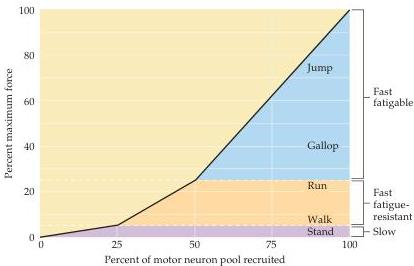
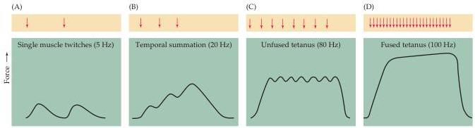

Chapter Fifteen

Figure 15.6 The recruitment of motor neurons in the cat medial gastrocnemius muscle under different behavioral conditions.
Slow (S) motor units provide the tension required for standing.
Fast fatigue-resistant (FR) units provide the additional force needed for walking and running.
Fast fatigable (FF) units are recruited for the most strenuous activities, such as jumping.
(After Walmsley et al., 1978.)

Figure 15.7 The effect of stimulation rate on muscle tension.
(A) At low frequencies of stimulation, each action potential in the motor neuron results in a single twitch of the related muscle fibers.
(B) At higher frequencies, the twitches sum to produce a force greater than that produced by single twitches.
(C) At a still higher frequency of stimulation, the force produced is greater, but individual twitches are still apparent.
This response is referred to as unfused tetanus.
(D) At the highest rates of motor neuron activation, individual twitches are no longer apparent (a condition called fused tetanus).

occurs with increased firing rate reflects the summation of successive muscle contractions: The muscle fibers are activated by the next action potential before they have had time to completely relax, and the forces generated by the temporally overlapping contractions are summed (Figure 15.7).
The lowest firing rates during a voluntary movement are on the order of 8 per second (Figure 15.8).
As the firing rate of individual units rises to a maximum of about 20-25 per second in the muscle being studied here, the amount of force produced increases.
At the highest firing rates, individual muscle fibers are in a state of "fused tetanus"—that is, the tension produced in individual motor units no longer has peaks and troughs that correspond to the individual twitches evoked by the motor neuron's action potentials.
Under normal conditions, the maximum firing rate of motor neurons is less than that required for fused tetanus (see Figure 15.8).
However, the asynchronous firing of different lower motor neurons provides a steady level of input to the muscle, which causes the contraction of a relatively constant number of motor units and averages out the changes in tension due to contractions and relaxations of individual motor units.
All this allows the resulting movements to be executed smoothly.

