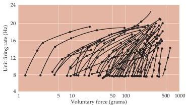

Lower Motor Neuron Circuits and Motor Control 379

Figure 15.8 Motor units recorded transcutaneously in a muscle of the human hand as the amount of voluntary force produced is progressively increased.
Motor units (represented by the lines between the dots) are initially recruited at a low frequency of firing (8 Hz); the rate of firing for each unit increases as the subject generates more and more force.
(After Monster and Chan, 1977.)

## The Spinal Cord Circuitry Underlying Muscle Stretch Reflexes

The local circuitry within the spinal cord mediates a number of sensory motor reflex actions.
The simplest of these reflex arcs entails a sensory response to muscle stretch, which provides direct excitatory feedback to the motor neurons innervating the muscle that has been stretched (Figure 15.9).
As already mentioned, the sensory signal for the stretch reflex originates in muscle spindles, the sensory receptors embedded within most muscles (see the previous section and Chapter 8).
The spindles comprise 8–10 intrafusal fibers arranged in parallel with the extrafusal fibers that make up the bulk of the muscle (Figure 15.9A).
Large-diameter sensory fibers, called Ia afferents, are coiled around the central part of the spindle.
These afferents are the largest axons in peripheral nerves and, since action potential conduction velocity is a direct function of axon diameter (see Chapters 2 and 3), they mediate very rapid reflex adjustments when the muscle is stretched.
The stretch imposed on the muscle deforms the intrafusal muscle fibers, which in turn initiate action potentials by activating mechanically gated ion channels in the afferent axons coiled around the spindle.
The centrally projecting branch of the sensory neuron forms monosynaptic excitatory connections with the α motor neurons in the ventral horn of the spinal cord that innervate the same (homonymous) muscle and, via local circuit neurons, forms inhibitory connections with the α motor neurons of antagonistic (heteronymous) muscles.
This arrangement is an example of what is called reciprocal innervation and results in rapid contraction of the stretched muscle and simultaneous relaxation of the antagonist muscle.
All of this leads to especially rapid and efficient responses to changes in the length or tension in the muscle (Figure 15.9B).
The excitatory pathway from a spindle to the α motor neurons innervating the same muscle is unusual in that it is a monosynaptic reflex; in most cases, sensory neurons from the periphery do not contact the lower motor neuron directly but exert their effects through local circuit neurons.

This monosynaptic reflex arc is variously referred to as the “stretch,” “deep tendon,” or “myotatic” reflex, and it is the basis of the knee, ankle, jaw, biceps, or triceps responses tested in a routine neurological examination.
The tap of the reflex hammer on the tendon stretches the muscle and therefore excites an afferent volley of activity in the Ia sensory axons that innervate the muscle spindles.
The afferent volley is relayed to the α motor neurons in the brainstem or spinal cord, and an efferent volley returns to the muscle (see Figure 1.5).
Since muscles are always under some degree of