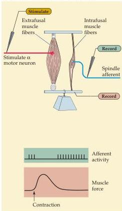
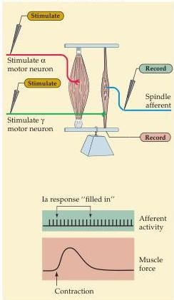

Chapter Fifteen

(A)  $\alpha$  Motor neuron activation without  $\gamma$
Figure 15.10 The role of  $\gamma$  motor neuron activity in regulating the responses of muscle spindles.
(A) When  $\alpha$  motor neurons are stimulated without activation of  $\gamma$  motor neurons, the response of the Ia fiber decreases as the muscle contracts.
(B) When both  $\alpha$  and  $\gamma$  motor neurons are activated, there is no decrease in Ia firing during muscle shortening.
Thus, the  $\gamma$  motor neurons can regulate the gain of muscle spindles so they can operate efficiently at any length of the parent muscle.
(After Hunt and Kuffler, 1951.)

(B)  $\alpha$  Motor neuron activation with  $\gamma$

pensate for the variable changes that occur as the bus stops and starts or progresses relatively smoothly.
During voluntary movements,  $\alpha$  and  $\gamma$  motor neurons are often co-activated by higher centers to prevent muscle spindles from being unloaded (Figure 15.10).

In addition, the level of  $\gamma$  motor neuron activity can be modulated independently of  $\alpha$  activity if the context of a movement requires it.
In general, the baseline activity level of  $\gamma$  motor neurons is high if a movement is relatively difficult and demands rapid and precise execution.
For example, recordings from cat hindlimb muscles show that  $\gamma$  activity is high when the animal has to perform a difficult movement such as walking across a narrow beam.
Unpredictable conditions, as when the animal is picked up or handled, also lead to marked increases in  $\gamma$  activity and greatly increased spindle responsiveness.

Gamma motor neuron activity, however, is not the only factor that sets the gain of the stretch reflex.
The gain also depends on the level of excitability of the  $\alpha$  motor neurons that serve as the efferent side of this reflex loop.
Thus, in addition to the influence of descending upper motor neuron projections, other local circuits in the spinal cord can change the gain of the stretch reflex by excitation or inhibition of either  $\alpha$  or  $\gamma$  motor neurons.

# Other Sensory Feedback That Affects Motor Performance

Another sensory receptor that is important in the reflex regulation of motor unit activity is the Golgi tendon organ.
Golgi tendon organs are encapsu